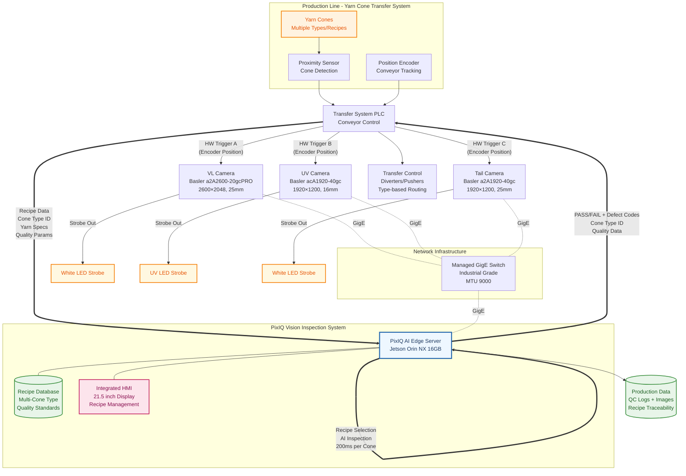
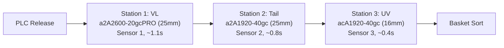
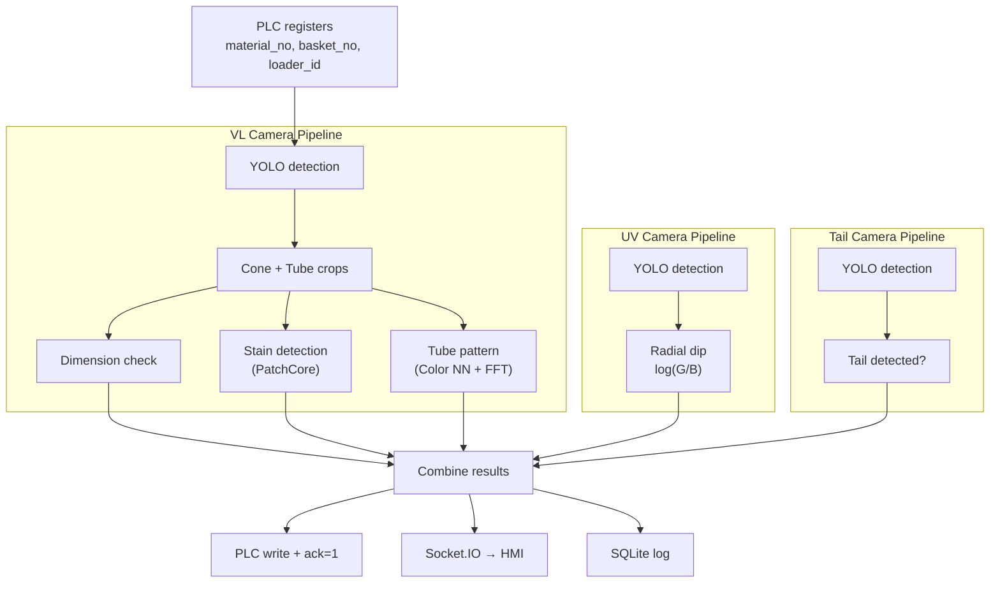

# Chapter 1: System Overview

## 1.1 Introduction

The Sieger pixIQ Yarn Cone Inspection System is an industrial quality inspection system deployed on the factory floor. It performs automated visual inspection of yarn cones on a moving conveyor, using three Basler GigE cameras and a PLC-controlled handshake to detect defects at production speed.

Each cone passes through three inspection stations sequentially. The system captures one image per station, runs CV/ML inference (TensorRT FP16), writes a pass/fail result to the PLC, and the PLC routes the cone to the correct basket.

### System Block Diagram

## 1.2 Inspection Checks

The system performs six quality checks per cone:

| Check | Camera | Method | What it detects |
|-------|--------|--------|-----------------|
| Dimension Verification | VL | YOLO bbox → pixels_per_mm | Wrong cone or tube outer diameter |
| Stain Detection | VL | PatchCore anomaly detection | Surface stains, dirt, foreign material |
| Tube Pattern Matching | VL | Color NN (Bhattacharyya on LAB) + FFT NN | Wrong tube pattern (color or stripe mismatch) |
| UV Thread Mixup | UV | Radial dip on log(G/B) profile | Mixed polymer threads (fluorescence difference) |
| Yarn Tail Presence | Tail | YOLO object detection | Missing yarn tail at cone base |
| Material ID Validation | VL | Recipe lookup | Unknown material_no from PLC |

Any single check failure → result_code=2 (Defect). If no checks run (camera timeout) → result_code=3 (Error).

## 1.3 Hardware Components

| Component | Model / Spec | Purpose |
|-----------|-------------|---------|
| VL Camera | Basler a2A2600-20gcPRO (2600×2048, 25mm) — 192.168.1.160 | Visible light inspection — stain, dimensions, pattern |
| UV Camera | Basler acA1920-40gc (1920×1200, 16mm) — 192.168.1.161 | UV fluorescence for thread mixup detection |
| Tail Camera | Basler a2A1920-40gc (1920×1200, 25mm) — 192.168.1.162 | Yarn tail presence detection |
| Camera SDK | Basler pypylon (pylon SDK) | GigE Vision acquisition |
| Proximity Sensors | 3× (one per station) | Hardware trigger for each camera via Line1 |
| PLC | Siemens S7, Modbus TCP (192.168.1.110:502) | Conveyor control, material data, result routing |
| Compute | NVIDIA Jetson Orin NX 16GB (ARM64, JetPack 6.x) | TensorRT FP16 inference + all services |
| UV Illumination | UV LED panel | Controlled via PLC register (40005) |
| VL Illumination | White LED panel | Controlled via PLC register (40006) |
| Tail Illumination | Dedicated LED | Controlled via PLC register (40007) |
| HMI | Separate all-in-one touchscreen desktop | Operator interface (Chromium → nginx :80) |

## 1.4 Software Architecture

Two Python services run on the Jetson Orin NX:

### Teaching API (Port 5002)
- **Framework:** FastAPI + Uvicorn
- **Purpose:** Material enrollment — teach tube patterns, set dimensions, manage recipes
- **Protocol:** REST/HTTP
- **Endpoints:** `/tube`, `/stain`, `/extract`, `/color_detection`, `/delete_master`, `/get_teaching_data`

### Inspection Service (Port 5004)
- **Framework:** Socket.IO + eventlet
- **Purpose:** Real-time inspection loop, camera control, PLC communication, live streaming
- **Protocol:** WebSocket (Socket.IO)
- **Threading:** Main thread (Socket.IO server) + worker thread (inspection loop)

Both services share:
- `data/recipes/` — JSON recipe files (one per material)
- `data/templates/tube/` — .npz tube pattern reference files
- `weights/` — YOLO model weights
- `models/` — PatchCore model

## 1.5 Conveyor Layout

Three inspection stations along the conveyor, each with a proximity sensor and camera:

Total capture time: ~2.3 seconds (conveyor speed dependent, not software limited).

Only one cone is in-flight between PLC and cameras at any time — enforced by the `cycle_start` handshake.

## 1.6 Inspection Cycle

One complete cycle per cone:

1. Vision writes `cycle_start=1` → PLC releases cone
2. PLC writes material data to registers, sets `trigger=1`
3. Vision polls registers, reads trigger + data in one bulk read
4. Vision clears trigger, captures VL → Tail → UV images
5. Vision runs inspection pipeline (~86ms)
6. Vision writes result + defect_type + echo fields to PLC
7. Vision sets `ack=1` → PLC reads results, routes cone, clears ack
8. Repeat

See [Chapter 3: PLC Communication](03_plc_communication.md) for the full register map and handshake protocol.

## 1.7 ML Models

| Model | Framework | Input | Output | Size | Inference |
|-------|-----------|-------|--------|------|-----------|
| VL YOLO | Ultralytics YOLOv12 | 2600×2048 BGR | yarn_cone + yarn_tube bboxes | ~6MB | TensorRT FP16 (.engine) |
| UV YOLO | Ultralytics YOLOv12 | 1920×1200 BGR | yarn_cone + yarn_tube bboxes | ~6MB | TensorRT FP16 (.engine) |
| Tail YOLO | Ultralytics YOLOv8 | 1920×1200 BGR | yarn_tail bbox | ~6MB | TensorRT FP16 (.engine) |
| PatchCore | Anomalib | 256×256 masked crop | Anomaly score (0-1) | ~50MB | TensorRT FP16 or PyTorch FP16 |
| Tube pattern | Color NN + FFT NN | 256×256 tube crop | Feature distance | ~2MB | CPU numpy |

All models are loaded lazily on first use and warmed up with a dummy inference to avoid first-cone latency. TensorRT engines are exported at deploy time on the target Jetson via `scripts/export_tensorrt.py`. `YOLODetector` auto-detects `.engine` files alongside `.pt` — no config change needed.

## 1.8 Data Flow

## 1.9 Key Dependencies

| Package | Version | Purpose |
|---------|---------|---------|
| ultralytics | >=8.4.11 | YOLO object detection |
| anomalib | >=2.2.0 | PatchCore stain detection |
| torch / torchvision | >=2.10 / >=0.25 | GPU inference (PyTorch FP16 fallback) |
| pypylon | latest | Basler camera SDK (ARM64: build from source) |
| opencv-python | >=4.13 | Image processing |
| pymodbustcp | >=0.3.0 | PLC Modbus TCP communication |
| fastapi / uvicorn | >=0.115 / >=0.34 | Teaching REST API |
| python-socketio / eventlet | >=5.16 / >=0.40 | Inspection service WebSocket |
| numpy | >=2.4 | Array operations |
| scikit-image | >=0.24 | Image processing utilities |
