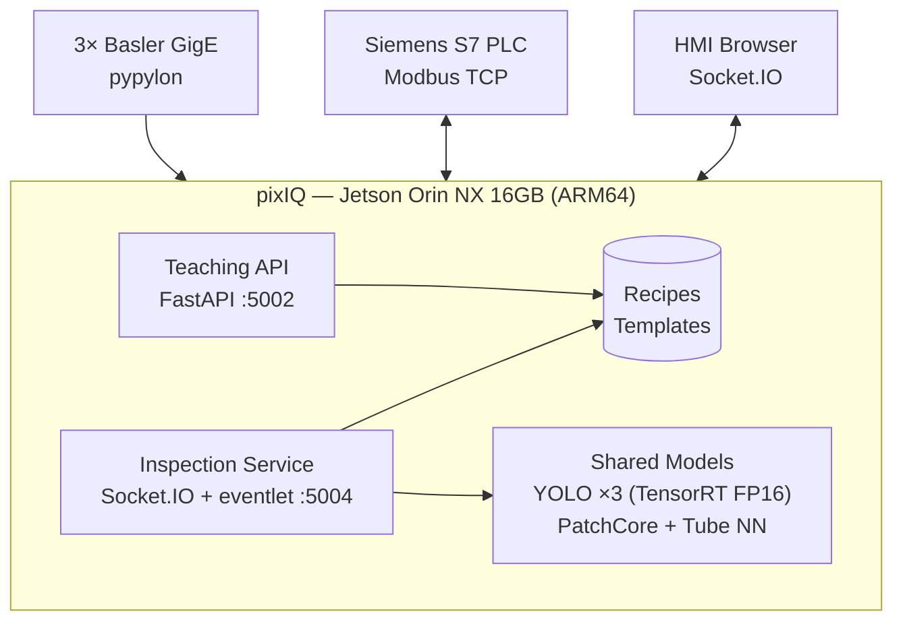

# Chapter 2: Architecture

## 2.1 High-Level Architecture



## 2.2 Service Architecture

### Teaching API

```
FastAPI (Port 5002)
  ├── /tube          — Teach tube pattern (capture + compute reference)
  ├── /stain         — Teach stain baseline
  ├── /extract       — Extract cone dimensions from frame
  ├── /delete_master — Delete teaching data for a material
  ├── /get_teaching_data — List all taught materials
  └── /restart, /shutdown — Service control
```

Stateless — reads/writes JSON recipes and .npz template files. No PLC or camera access.

### Inspection Service

```
Socket.IO Server (Port 5004, eventlet)
  ├── Main thread: Socket.IO event handlers
  │     ├── start_inspection / stop_inspection
  │     ├── connect_cam (live feed)
  │     ├── on_light / off_light / light_status  (legacy — PLC controls lights directly in v3.1.0+, HMI does not use these)
  │     ├── check_plc / get_plc_info
  │     └── health_check / check_cameras
  │
  └── Worker thread: Inspection loop
        ├── PLC handshake (cycle_start → trigger → ack)
        ├── Camera capture (VL → Tail → UV)
        ├── CV/ML pipeline (YOLO → Dims → Stain → Pattern → UV → Tail)
        ├── PLC result write
        └── UI streaming (send_image event)
```

State machine with 4 primary modes: IDLE, CAPTURE, INSPECT, LIVE_FEED.

## 2.3 Source Code Layout

```
src/
├── api/
│   ├── main.py              — FastAPI app, all REST endpoints
│   └── models.py            — Pydantic request/response models
├── camera/
│   ├── camera.py            — Basler pypylon camera wrapper (connect, capture, reconnect)
│   ├── capture.py           — CaptureSequence (3-camera sequential capture)
│   ├── data_types.py        — CapturedImages dataclass
│   └── mock_camera.py       — Mock for local testing without hardware
├── inspection/
│   ├── visible.py           — VL inspection orchestrator (YOLO + dims + stain + pattern)
│   ├── dimension_check.py   — Bbox-to-mm conversion, spec comparison
│   ├── stain_detector.py    — PatchCore anomaly detection
│   ├── tube_pattern.py      — Color NN + FFT NN + ResNet monitoring
│   ├── uv_inspection.py     — Radial dip thread mixup detection
│   ├── tail_inspection.py   — YOLO tail presence detection
│   ├── yolo_detector.py     — YOLO wrapper (shared by VL, UV, Tail)
│   ├── recipe_store.py      — JSON recipe file reader
│   ├── database.py          — Material specs DB interface
│   ├── data_types.py        — Result dataclasses
│   ├── visualization.py     — Annotated frame rendering
│   ├── polar_unwarp.py      — Polar-to-cartesian transform (tube surface)
│   └── color_matching/      — Tube pattern sub-pipeline
│       ├── preprocess_pipeline.py
│       ├── match_pattern.py
│       ├── get_signature.py
│       ├── histogram_2d.py
│       ├── bhattacharyya_distance.py
│       └── ... (10+ modules)
├── plc/
│   ├── client.py            — Modbus TCP client (read/write registers)
│   ├── data_types.py        — PLCInput, PLCOutput dataclasses
│   └── mock_plc_client.py   — Mock for local testing
├── services/
│   ├── inspection_service.py — Main inspection service (Socket.IO + worker)
│   └── mock_inspection_service.py — Mock service for local testing
├── teaching/
│   ├── tube_teacher.py      — Tube pattern reference computation
│   └── api.py               — Teaching API helpers
├── cloud/
│   └── uploader.py          — Azure blob storage upload
├── db/
│   ├── schema.py            — SQLite schema (inspection results)
│   └── writer.py            — InspectionWriter (write results to DB)
├── init_app.py              — Folder creation, DB migration
├── logging_config.py        — Centralized logging setup
├── pipeline.py              — [DEPRECATED] Old v1 pipeline, to be deleted
└── config.json              — Runtime configuration
```

## 2.4 Data Storage

### Runtime Data (on compute platform)

| Path | Content | Lifecycle |
|------|---------|-----------|
| `data/recipes/{material_id}.json` | Material specs (diameters, tolerances) | Permanent — created by teaching |
| `data/templates/tube/{material_id}.npz` | Tube pattern reference (histograms, FFT, ResNet features) | Permanent — created by teaching |
| `sieger_data/sieger.db` | SQLite inspection results log | Permanent — one row per cone |
| `sieger_data/debug/{material_id}/{date}/` | UV frames for traceability | 2-day retention (cron cleanup) |
| `sieger_data/captures/{material_id}/{camera}/` | Captured images during data collection | Until sorted/moved |

### Model Files (pre-deployed)

| Path | Content |
|------|---------|
| `weights/visible_yolo.pt` | VL YOLO model |
| `weights/uv_yolo.pt` | UV YOLO model |
| `weights/yarn_tail_v3.pt` | Tail YOLO model |
| `models/patchcore/` | PatchCore model directory |

## 2.5 Communication Protocols

| From | To | Protocol | Purpose |
|------|----|----------|---------|
| Vision → PLC | Modbus TCP (port 502) | Handshake, results, light control |
| Vision → HMI | Socket.IO (port 5004) | Live frames, reports, status |
| HMI → Vision | Socket.IO (port 5004) | Start/stop, camera control, settings |
| HMI → Teaching API | HTTP REST (port 5002) | Teach materials, manage recipes |
| Vision → SQLite | File I/O | Inspection result logging |
| Vision → Azure | HTTPS | Cloud upload (if enabled) |

## 2.6 Thread Safety

The inspection service uses eventlet (cooperative multithreading). Key synchronization:

- **PLC client:** All Modbus socket operations serialized via `threading.Lock` — eventlet monkey-patches sockets and doesn't allow concurrent read/write on the same socket.
- **ServiceState:** State transitions protected by `threading.Lock`.
- **AnalyticsState:** Counters updated under dedicated `threading.Lock`.
- **Result queue:** `queue.Queue(maxsize=100)` — thread-safe, drop-oldest on overflow.
- **Camera reconnect:** Backoff state (`_cam_reconnect_intervals`, `_cam_reconnect_next_at`) accessed only from worker thread — no lock needed.

## 2.7 Error Handling Strategy

- **Camera failure:** Each camera is independent — if one crashes/disconnects, the others continue. Inspection pipeline handles None frames gracefully.
- **PLC failure:** Vision continues in simulation mode (1s delay per cycle, no results written). Reconnects with exponential backoff.
- **Inspection failure:** Unhandled exceptions in the pipeline trigger Error result (code=3) written to PLC via ack — conveyor never stops.
- **Model failure:** Warm-up inference on startup catches load errors early. Runtime failures result in code=3 for that check.

## 2.8 Platform — Jetson Orin NX 16GB

The compute platform is the NVIDIA Jetson Orin NX 16GB (ARM64, JetPack 6.x). The HMI runs on a separate all-in-one touchscreen desktop. All cameras are Basler GigE — no IDS cameras.

### Key Specs

| Component | Spec |
|-----------|------|
| Camera SDK | Basler pypylon |
| GPU | Orin NX (16GB shared CPU+GPU) |
| CPU | 6-core ARM64 |
| Inference | TensorRT FP16 (primary), PyTorch FP16 (fallback) |
| HMI | Separate all-in-one touchscreen desktop |

### Camera Module

```
src/camera/
├── camera.py            — Basler pypylon camera wrapper
├── capture.py           — CaptureSequence (3-camera sequential)
├── data_types.py        — CapturedImages dataclass
└── mock_camera.py       — Mock for local testing without hardware
```

### Inference Strategy

**TensorRT FP16 on GPU. No DLA, no INT8.**

DLA only supports INT8 quantization which loses precision on anomaly scores, color histograms, and pattern distances. In manufacturing inspection, accuracy loss means missed defects — unacceptable.

```json
{
    "inspection": {
        "backend": "tensorrt",
        "precision": "fp16"
    }
}
```

| Model | Backend | Notes |
|-------|---------|-------|
| YOLO (VL, UV, Tail) | TensorRT FP16 (.engine) | Auto-detected alongside .pt |
| PatchCore (stain) | TensorRT FP16 or PyTorch FP16 | |
| Tube pattern (Color NN + FFT) | CPU numpy | No GPU needed |

TensorRT engines are exported at deploy time on the target device:
```bash
uv run python scripts/export_tensorrt.py
```

`YOLODetector` auto-detects `.engine` files alongside `.pt` — no config change needed. Config always references `.pt` paths; if a `.engine` exists, TensorRT is used automatically.

### Memory Budget (Jetson 16GB shared)

| Component | Memory |
|-----------|--------|
| OS + system | ~2GB |
| Python + OpenCV + numpy | ~1GB |
| 3x YOLO TensorRT FP16 | ~300MB |
| PatchCore TensorRT FP16 | ~300MB |
| Camera buffers (3 GigE) | ~500MB |
| **Total** | **~4.1GB — leaves ~12GB free** |

### Standard Network Layout (All New Machines)

| Device | IP |
|--------|-----|
| VL Camera (GigE) | 192.168.1.160 |
| UV Camera (GigE) | 192.168.1.161 |
| Tail Camera (GigE) | 192.168.1.162 |
| PLC | 192.168.1.110 |
