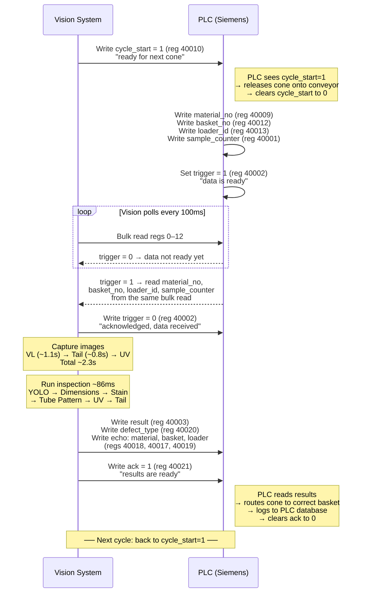
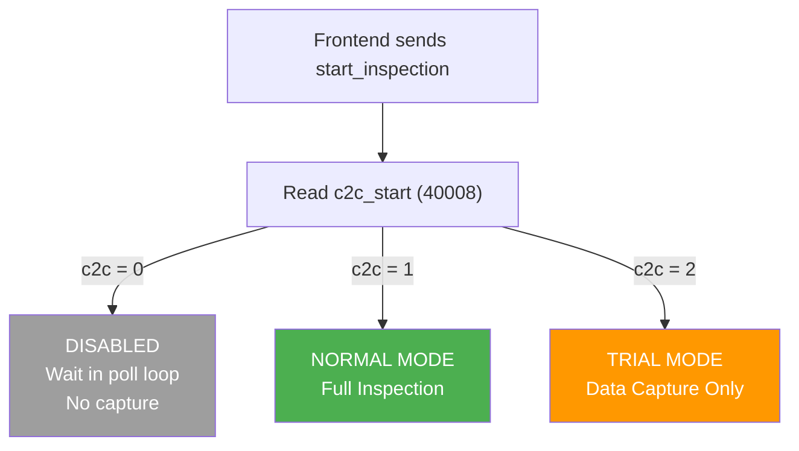
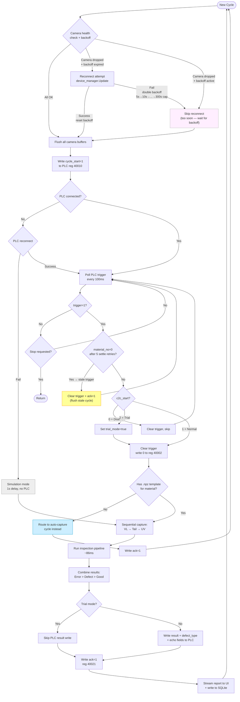

# Chapter 3: PLC Communication

## 3.1 Overview

The vision system communicates with the Siemens S7 PLC via Modbus TCP (port 502). The PLC controls the conveyor, material routing, and lighting. Vision reads material data, writes inspection results, and uses a handshake protocol to synchronize cone flow.

Library: `pyModbusTCP`. All register operations are serialized with a `threading.Lock` to prevent eventlet socket conflicts.

## 3.2 Handshake Protocol

One cycle per cone:



### Timing (from production logs)

| Phase | Duration |
|-------|----------|
| cycle_start → trigger received | ~3s (conveyor travel) |
| Capture (VL + Tail + UV) | ~2.3s |
| Inspection pipeline | ~86ms |
| PLC write + ack | <10ms |
| **Total cycle** | **~3-4s per cone** |

## 3.3 Register Map

```mermaid
flowchart TB
    subgraph INPUT ["INPUT REGISTERS (PLC → Vision)"]
        direction TB
        R0["40001 (addr 0)\nsample_counter"]
        R1["40002 (addr 1)\ntrigger\n1=Start, 0=Cleared"]
        R7["40008 (addr 7)\nc2c_start\n0=Disabled 1=Normal 2=Trial"]
        R8["40009 (addr 8)\nmaterial_no"]
        R11["40012 (addr 11)\nbasket_no"]
        R12["40013 (addr 12)\nloader_id"]
    end

    subgraph OUTPUT ["OUTPUT REGISTERS (Vision → PLC)"]
        direction TB
        R2["40003 (addr 2)\nresult\n1=Good 2=Defect 3=Error"]
        R14["40015 (addr 14)\ncamera_error\n0=OK"]
        R15["40016 (addr 15)\nips_status\n1=Active 2=Trial 3=Disabled"]
        R16["40017 (addr 16)\nbasket_no echo"]
        R17["40018 (addr 17)\nmaterial_no echo"]
        R18["40019 (addr 18)\nloader_no echo"]
        R19["40020 (addr 19)\ndefect_type\n0=Good 1=Stain 2=WrongPattern\n3=ConeDia 4=TubeDia 5=MissingTail\n6=ThreadMixup"]
        R20["40021 (addr 20)\nack\nVision=1 PLC clears=0"]
    end

    subgraph LIGHTS ["LIGHT REGISTERS (Vision → PLC)"]
        direction TB
        R4["40005 (addr 4)\nUV light"]
        R5["40006 (addr 5)\nVL/LED light"]
        R6["40007 (addr 6)\nYarntail light"]
    end

    style INPUT fill:#E3F2FD,stroke:#1565C0
    style OUTPUT fill:#FFF3E0,stroke:#E65100
    style LIGHTS fill:#E8F5E9,stroke:#2E7D32
    style R1 fill:#FF9800,color:#fff
    style R7 fill:#FF9800,color:#fff
    style R2 fill:#F44336,color:#fff
    style R20 fill:#F44336,color:#fff
```



### Input Registers (PLC → Vision)

| Register | Address (0-based) | Field | Description |
|----------|-------------------|-------|-------------|
| 40001 | 0 | sample_counter | Part counter from PLC |
| 40002 | 1 | trigger | 1=material data ready, vision clears to 0 |
| 40008 | 7 | c2c_start | 0=disabled, 1=normal, 2=trial run |
| 40009 | 8 | material_no | Numeric material identifier |
| 40012 | 11 | basket_no | Basket/sorting identifier |
| 40013 | 12 | loader_id | Loader identifier |

### Output Registers (Vision → PLC)

| Register | Address (0-based) | Field | Description |
|----------|-------------------|-------|-------------|
| 40003 | 2 | result | 1=Good, 2=Defect, 3=Error |
| 40005 | 4 | uv_light | UV light on/off |
| 40006 | 5 | vl_light | Visible LED on/off |
| 40007 | 6 | yarntail_light | Tail light on/off |
| 40010 | 9 | cycle_start | Vision sets 1="ready for next cone" |
| 40015 | 14 | camera_error | Error code (0=OK) |
| 40016 | 15 | ips_status | 1=active, 2=trial, 3=disabled |
| 40017 | 16 | basket_no_echo | Echo basket_no back to PLC |
| 40018 | 17 | material_no_echo | Echo material_no back to PLC |
| 40019 | 18 | loader_no_echo | Echo loader_id back to PLC |
| 40020 | 19 | defect_type | Defect type code (0-7) |
| 40021 | 20 | ack | Vision sets 1="results ready", PLC clears to 0 |

### Defect Type Codes (reg 40020)

| Code | Defect |
|------|--------|
| 0 | Good |
| 1 | Stain |
| 2 | Wrong Pattern |
| 3 | Wrong Cone Diameter |
| 4 | Wrong Tube Diameter |
| 5 | Missing Tail |
| 6 | Thread Mixup |
| 7 | No Material ID |

## 3.4 c2c_start Modes

The PLC display allows operators to change the inspection mode at any time via register 40008:



| Value | Mode | Behavior |
|-------|------|----------|
| 0 | Disabled | Vision clears trigger and skips — no inspection, no capture |
| 1 | Normal | Full inspection — results written to PLC |
| 2 | Trial | Full inspection — results NOT written to PLC (monitoring only) |

Vision checks c2c_start on every trigger. Mode changes take effect on the next cone.

## 3.5 Bulk Read Optimization

`poll_trigger_and_read()` reads registers 0-12 (40001-40013) in a single Modbus call. If trigger=1, the material data is already in the same response — no second read needed.

If trigger=1 but material_no=0, the PLC may not have finished writing data yet. The client retries up to 5 times with 50ms delays before treating it as a stale trigger.

## 3.6 Stale Trigger Handling

If material_no remains 0 after 5 settle retries:
1. Clear trigger (write 0 to reg 40002)
2. Write ack=1 (reg 40021) to flush the cycle
3. Return to polling

**Known issue:** After flushing a stale trigger, vision does not re-send cycle_start=1. If the PLC waits for cycle_start before sending the next trigger, this could cause a deadlock. See [plc-update.md](plc-update.md) for details.

## 3.7 PLC Connection Handling

- **Startup:** Vision connects to PLC on service start. If connection fails, runs in simulation mode.
- **Reconnect:** If PLC drops during operation, vision attempts reconnect on each cycle. No exponential backoff (PLC reconnect is fast — just a TCP connect).
- **Simulation mode:** When PLC is not connected, vision waits 1 second per cycle and processes with material_id="unknown". Useful for development/testing.

## 3.8 Configuration

PLC settings in `config.json`:

```json
{
    "plc": {
        "host": "192.168.1.110",
        "port": 502,
        "unit_id": 1,
        "timeout": 3.0,
        "poll_interval": 0.1,
        "registers": {
            "input": {
                "sample_counter": 0,
                "trigger": 1,
                "c2c_start": 7,
                "material_no": 8,
                "basket_no": 11,
                "loader_id": 12
            },
            "output": {
                "result": 2,
                "camera_error": 14,
                "ips_status": 15,
                "basket_no_echo": 16,
                "material_no_echo": 17,
                "loader_no_echo": 18,
                "cycle_start": 9,
                "defect_type": 19,
                "ack": 20
            },
            "light": {
                "uv": 4,
                "vl": 5,
                "yarntail": 6
            }
        }
    }
}
```

All register addresses are configurable — the PLC client reads them from config at startup. However, `poll_trigger_and_read()` uses hardcoded array indices (0, 1, 7, 8, 11, 12) that assume the standard register layout.

## 3.9 Error & Edge Case Flow

The complete error handling flow including camera reconnect backoff, stale triggers, simulation mode, and trial mode:


