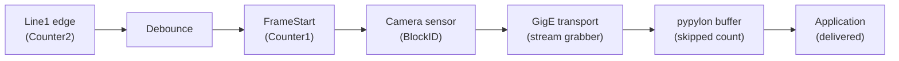
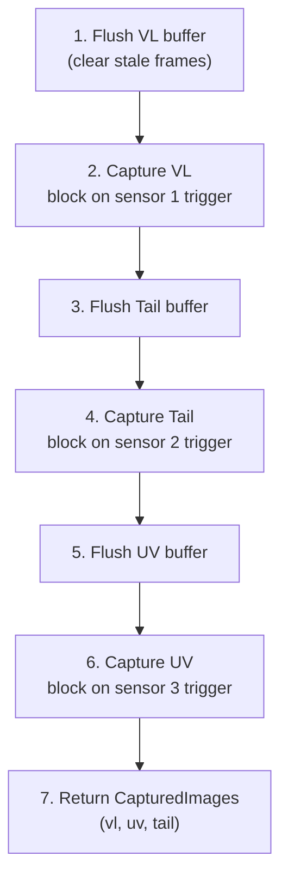

# Chapter 4: Camera & Capture

## 4.1 Overview

Three Basler GigE cameras capture images sequentially — VL, Tail, UV — with light switching between each. All cameras use the Basler pypylon SDK. Cameras are hardware-triggered by proximity sensors on the conveyor (Line1 rising edge).

<<<<<<< HEAD
| Camera | Model | IP | Resolution | Exposure | Light Relay | View |
|--------|-------|----|------------|----------|-------------|------|
| VL | a2A2600-20gcPRO | 192.168.2.10 | 2600×2048 (25mm, 6mp) | 11 ms | 40006 | Side view of cone |
| UV | acA1920-40gc | 192.168.2.11 | 1920×1200 (16mm, 5mp) | 70 ms | 40005 | Side view under UV |
| Tail | a2A1920-40gc | 192.168.2.12 | 1920×1200 (25mm, 5mp) | 8 ms | 40007 | Top-down, yarn tail |
=======
| Camera | Model | Lens | IP | Resolution | Exposure | Light Relay | View |
|--------|-------|------|----|------------|----------|-------------|------|
| VL | a2A2600-20gcPRO | 25 mm | 192.168.1.160 | 2600×2048 | 11 ms | 40006 | Side view of cone |
| UV | acA1920-40gc | 16 mm | 192.168.1.161 | 1920×1200 | 70 ms | 40005 | Side view under UV |
| Tail | a2A1920-40gc | 25 mm | 192.168.1.162 | 1920×1200 | 8 ms | 40007 | Top-down, yarn tail |
>>>>>>> origin/main

## 4.2 Camera Class

`src/camera/camera.py` — wraps the Basler pypylon SDK into a single `Camera` object.

### Constructor

```python
Camera(name, exposure, timeout=30000, ip=None, serial=None, trigger_debounce_us=0)
```

- `name`: human-readable identifier ("VL", "UV", "Tail")
- `exposure`: exposure time in microseconds
- `timeout`: frame grab timeout in milliseconds (default 30s)
- `ip` or `serial`: exactly one must be provided (GigE uses IP, serial as fallback)
- `trigger_debounce_us`: hardware debounce to filter sensor bounce (0 = disabled, typical 200000 us)

### Connection Lifecycle

**`connect()`** — opens camera, configures trigger, starts acquisition:

1. Find device by IP or serial via `pylon.TlFactory.CreateFirstDevice()`
2. Open with `camera.Open()`
3. Configure hardware trigger: `TriggerSelector=FrameStart`, `TriggerMode=On`, `TriggerSource=Line1`, `TriggerActivation=RisingEdge`
4. Set `LineDebouncerTime` if trigger_debounce_us configured
5. Set exposure time (`ExposureTime` for ace 2, `ExposureTimeAbs` for ace classic)
6. Configure GigE: packet size 8192 (jumbo frames), inter-packet delay, packet resend
7. Create `ImageFormatConverter` (Bayer/Mono → BGR8packed for OpenCV)
8. Start acquisition with `GrabStrategy_LatestImageOnly` (auto-discards stale frames)

**`disconnect()`** — stops grabbing, closes device. Safe to call even if not connected.

**`reconnect()`** — disconnect and reconnect. Returns `True` on success. No device_manager needed — pypylon discovers devices internally.

### Capture Methods

**`capture(timeout_ms=None)`** — blocks until hardware trigger fires, returns BGR `np.ndarray`. For software trigger mode, executes `ExecuteSoftwareTrigger()` first. Raises `TimeoutError` on timeout.

**`capture_latest(timeout_ms=None)`** — equivalent to `capture()` because `GrabStrategy_LatestImageOnly` automatically keeps only the most recent frame.

**`flush_buffers()`** — non-blocking drain-and-discard of any remaining frames in the output queue.

### Image Conversion

`_grab_to_bgr(grab_result)` uses `pylon.ImageFormatConverter` to convert Bayer/Mono sensor output to BGR8packed numpy array. The converter is created once during `connect()` and reused for all frames.

- ace classic (acA1920-40gc, UV): BayerBG8 → BGR8
- ace 2 (a2A1920-40gc, Tail): BayerBG8 → BGR8
- ace 2 PRO (a2A2600-20gcPRO, VL): BayerRG8 → BGR8

### Observability

Three layers of counters give full visibility into the trigger-to-frame pipeline:



**Camera-side (hardware counters):**

| Method | Returns | Purpose |
|--------|---------|---------|
| `get_trigger_count()` | `int` | Counter1 — FrameStart events (frames the camera produced) |
| `get_line_trigger_count()` | `int` | Counter2 — raw Line1 rising edges (before debounce) |
| `get_temperature()` | `float` | Sensor temperature in °C |
| `get_line_status()` | `bool` | Current state of Line1 (trigger input) |

**Transport-layer (stream grabber, read via `get_stream_statistics()`):**

| Stat | Meaning |
|------|---------|
| `missed` | Frames camera sent but pylon never received (network drops) |
| `failed` | Frames received but incomplete/corrupt |
| `buffer_underruns` | Frames lost because no buffer was available |
| `resend_requests` | GigE packet resend requests sent |
| `resend_packets` | Actual packets retransmitted |

**Application-side (software counters, tracked per grab result):**

| Stat | Meaning |
|------|---------|
| `delivered` | Frames successfully converted to BGR and returned to app |
| `skipped` | Frames pypylon discarded (LatestImageOnly strategy) |
| `block_id_gaps` | Gaps in camera BlockID sequence (transport drops) |

**Leakage analysis (logged by `log_stream_statistics()`):**

| Comparison | Indicates |
|------------|-----------|
| `line_trigger_count > frame_count` | Debouncer filtered spurious triggers (sensor bounce) |
| `frame_count > delivered + skipped` | Frames lost in GigE transport layer |
| `block_id_gaps > 0` | Specific frames dropped between camera and application |
| `temperature > 70°C` | Camera overheating warning |

**ace classic vs ace 2 counter differences** are handled automatically:
- ace 2 (a2A2600-20gcPRO, a2A1920-40gc): uses `CounterTriggerSource`, `CounterEventActivation`
- ace classic (acA1920-40gc): uses `CounterEventSource` only

| Method | Returns | Purpose |
|--------|---------|---------|
| `health_check()` | `bool` | Checks if camera is open and reachable |
| `get_stream_statistics()` | `dict` | Full observability snapshot (all three layers) |
| `log_stream_statistics()` | — | Logs stats at INFO, warns on any leakage |
| `reset_trigger_count()` | — | Resets all hardware + software counters |

### Buffer Management

- `BUFFER_COUNT = 5` — pypylon buffer pool size
- `GrabStrategy_LatestImageOnly` — pypylon automatically discards stale frames, keeping only the latest
- `grab_result.Release()` must always be called to return buffer to pool
- `.copy()` on numpy arrays ensures data survives after Release()

## 4.3 Capture Sequence

`src/camera/capture.py` — orchestrates sequential capture across all three cameras.

### CaptureSequence Class

```python
CaptureSequence(cam_vl: Camera, cam_uv: Camera, cam_tail: Camera)
```

No `device_manager` parameter needed — pypylon handles device discovery internally.

### capture_part() Flow

Captures one complete part (3 images) sequentially:



Each camera is wrapped in try/except — one camera failure does not affect others. A failed camera returns `None` in the `CapturedImages` dataclass; the inspection pipeline handles missing frames gracefully.

Uses `capture_latest()` (not `capture()`) to handle stale frames from sensor vibration or bounce.

### Acquisition Control

| Method | Purpose |
|--------|---------|
| `stop_acquisition()` | Stop all 3 cameras (e.g., during teaching mode) |
| `start_acquisition()` | Restart all 3; attempts reconnect on failure |
| `flush_buffers()` | Non-blocking flush on all 3 cameras |
| `flush_all(timeout_ms=2000)` | Consume and discard triggers from all 3 cameras — used when a part is rejected but already on conveyor |

### CapturedImages Dataclass

```python
@dataclass(slots=True)
class CapturedImages:
    vl: Optional[np.ndarray] = None
    uv: Optional[np.ndarray] = None
    tail: Optional[np.ndarray] = None
```

Any field may be `None` if the camera timed out or errored.

## 4.4 Sequential Capture Rationale

Cameras fire sequentially (not in parallel) because:

1. **Light switching** — VL, Tail, and UV lights use different PLC relays. Each light must be on during its camera's exposure and off before the next.
2. **Settling time** — UV light requires ~10 ms to stabilize after relay switch.
3. **Single GigE bus** — VL and UV share the same GigE network; simultaneous capture risks packet collisions.

Total capture time (~2.3s) is dominated by conveyor travel between stations, not software.

## 4.5 Trigger Debouncing

Proximity sensors on the conveyor can bounce (multiple rising edges from a single cone pass). Two levels of protection:

1. **Hardware debounce** — `trigger_debounce_us` parameter sets `LineDebouncerTime` on the camera (200 ms typical). The camera ignores rising edges within the debounce window after the first.
2. **GrabStrategy_LatestImageOnly** — pypylon automatically discards old frames, keeping only the latest. No software drain loop needed.

## 4.6 Camera Health Monitoring

The inspection service checks camera health between cycles:

1. Before `cycle_start`, call `health_check()` on each camera
2. If a camera reports disconnected, attempt `reconnect()` — pypylon re-discovers devices internally
3. If reconnect fails, camera is `None` for that cycle — inspection runs with available cameras
4. Persistent failure writes `camera_error=1` to PLC register 40015
5. 5 consecutive UV detection failures trigger `logger.error()` (camera issue, not real defect)

## 4.7 GigE Optimization

- **Jumbo frames** — `GevSCPSPacketSize` set to 8192 bytes. Reduces packet count per frame, lowers CPU overhead.
- **Inter-packet delay** — `GevSCPD = 1000` ticks. Spreads packets to avoid NIC overflow.
- **Packet resend** — `EnableResend = True` on stream grabber. Retransmits lost packets instead of dropping entire frame.
- **Trigger activation** — explicitly set to `RisingEdge`.

## 4.8 Mock Cameras

For development/testing without hardware:

- `MockCamera` — reads images from a folder in cyclic order, simulates 50 ms capture delay
- `MockCaptureSequence` — same interface as `CaptureSequence`, uses `MockCamera` instances
- `MockInspectionService` inherits from `InspectionService`, overrides `_init_cameras()` to use mocks

Mock cameras are configured via `config.json → cameras → folder_path` per camera.

## 4.9 Configuration

Camera settings in `config.json`:

```json
{
    "cameras": {
        "VL": {
            "ip": "192.168.1.160",
            "exposure": 11000,
            "timeout": 2000,
            "trigger_debounce_us": 200000
        },
        "UV": {
            "ip": "192.168.1.161",
            "exposure": 70000,
            "timeout": 2000,
            "trigger_debounce_us": 200000
        },
        "Tail": {
            "ip": "192.168.1.162",
            "exposure": 8000,
            "timeout": 2000,
            "trigger_debounce_us": 200000
        }
    }
}
```

All values are read at service startup. Exposure can be changed at runtime via Socket.IO `connect_cam` event.
