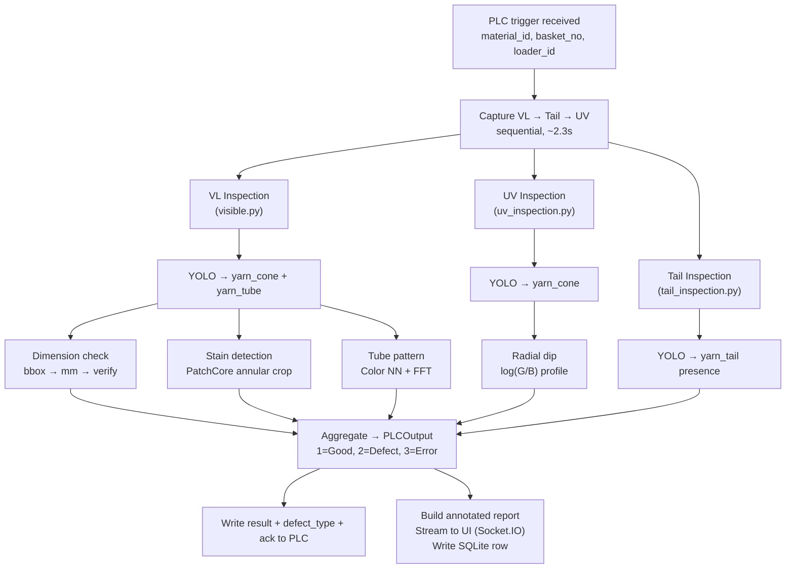
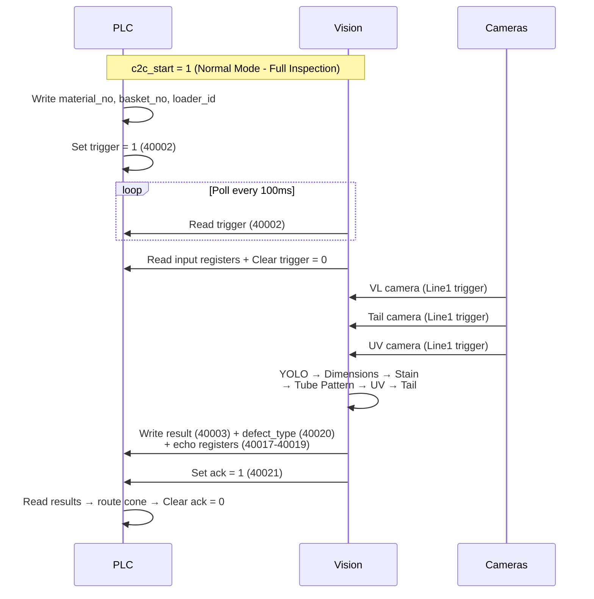
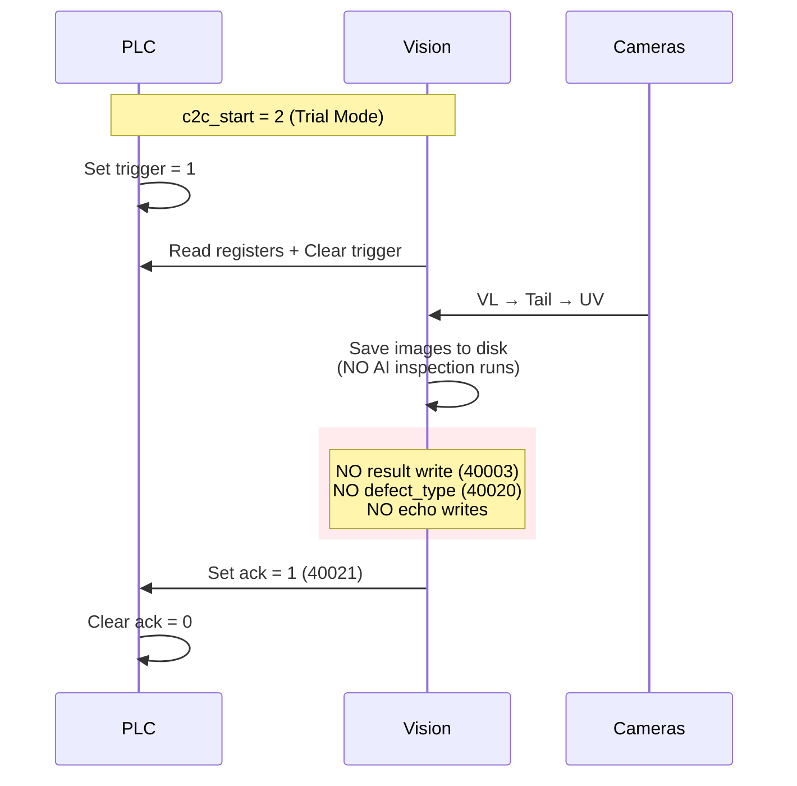

# Chapter 5: Inspection Pipeline

## 5.1 Overview

The inspection pipeline runs once per cone. It receives three camera frames (VL, UV, Tail), runs parallel inspection modules, aggregates results, writes to PLC, logs to SQLite, and streams a report to the UI.

The pipeline is orchestrated by `InspectionService._inspect_and_report()` in `src/services/inspection_service.py`.

## 5.2 Pipeline Flow



## 5.3 Visible Light Inspection

`src/inspection/visible.py` — `VisibleInspection` class orchestrates all VL-based checks.

### process_frame(frame, material_id) → InspectionResult

**Step 1: YOLO Detection** (always runs)

- Runs YOLOv12 on the VL frame
- Detects `yarn_cone` and `yarn_tube` bounding boxes
- Keeps highest-confidence detection per class
- Image padded to 1.6 aspect ratio before inference, bboxes mapped back to original coordinates

**Step 2: Extract ROIs**

- Rectangular crop for dimension check (needs background contrast for bbox width)
- Annular-masked crop for tube pattern (zeros out corners and inner tube hole)

**Step 3: Dimension Check** (if enabled)

- Measures cone and tube diameters from bbox widths: `diameter_mm = min(w, h) / pixels_per_mm`
- Verifies against global site specs ± tolerance

**Step 4: Stain Detection** (if enabled, requires cone + tube detection)

- Derives geometry from bboxes: center, inner_r (tube), outer_r (cone)
- Creates annular mask (donut shape) — only yarn surface
- Runs PatchCore inference on 256x256 masked crop
- Score = max anomaly value in valid pixels

**Step 5: Tube Pattern** (if enabled, requires tube detection)

- Runs tube pattern verification against material_id template
- Color NN (Bhattacharyya on LAB) + FFT NN (cosine on spatial frequency)
- Weighted combination: 70% color + 30% FFT

### Task Enable/Disable

Tasks are controlled via `config.json → inspection.tasks`:

```json
{
    "tasks": {
        "dimension_check": true,
        "stain_detection": true,
        "tube_pattern": true,
        "uv_inspection": true,
        "tail_inspection": true
    }
}
```

Disabled tasks are treated as OK (not checked = not failed).

## 5.4 Result Aggregation

### InspectionResult Properties

**`passed`** — overall pass/fail:
- Returns `False` if `material_not_found`
- All enabled task results must pass
- Disabled tasks are ignored

**`result_code`**:
- `1` = Good (all enabled checks passed)
- `2` = Defect (any enabled check failed, or material_not_found)
- `3` = Error (pipeline exception, missing detection, enabled task has no result)

### Defect Type Priority

When multiple checks fail, `defect_type_code` reports the first failure found in this order:

| Priority | Code | Defect |
|----------|------|--------|
| 1 | 7 | No Material ID |
| 2 | 1 | Stain |
| 3 | 2 | Wrong Pattern |
| 4 | 3 | Wrong Cone Diameter |
| 5 | 4 | Wrong Tube Diameter |
| 6 | 5 | Missing Tail |
| 7 | 6 | Thread Mixup |
| 0 | 0 | Good (no defect) |

## 5.5 Normal Mode Sequence



### Trial Mode

In trial mode (`c2c_start=2`), the full inspection runs but results are **not written** to PLC. Only `ack=1` is sent. Used for monitoring without affecting production sorting.



## 5.6 PLC Output

After inspection, vision writes to PLC:

1. `result` (reg 40003) — 1/2/3
2. `defect_type` (reg 40020) — 0-7
3. `basket_no_echo` (reg 40017) — echo back basket_no
4. `material_no_echo` (reg 40018) — echo back material_no
5. `loader_no_echo` (reg 40019) — echo back loader_id
6. `ack=1` (reg 40021) — results ready

In **trial mode** (`c2c_start=2`), result and defect_type are NOT written to PLC, but ack is still sent. Inspection runs normally for monitoring.

## 5.7 Report Streaming

After each inspection, the service:

1. Builds an annotated composite image via `src/inspection/visualization.py`
2. Encodes as base64 JPEG (configurable resolution and quality)
3. Emits Socket.IO `frame` event with:
   - `camera`: "report"
   - `image`: base64 JPEG
   - `result`: result_code
   - `defect_type`: defect_type_code
   - `material_id`: material string
   - `timestamp`: ISO-8601
   - Per-module scores: tube (distance, threshold), stain (score), uv (radial_dip), tail (result), dimension (cone_mm, tube_mm)

## 5.8 Database Logging

Each inspection writes one row to the `inspections` table via `InspectionWriter.write()`:

- All PLC fields (material_id, basket_no, loader_id, sample_counter)
- Result code and defect type
- Per-module results and scores (stain_score, tube_distance, radial_dip, tail_confidence, diameters)
- Trial mode flag
- Audit image filename

After writing, `_check_rejection_rate()` checks the last 20 results for this material. If rejection rate > 30%, a warning is logged.

## 5.9 Audit Images

Annotated composite JPEGs are saved to `sieger_data/audit/YYYY-MM-DD/{inspection_id}.jpg`. These contain:

- Full frame with YOLO bounding boxes and dimension annotations
- Cone crop with stain heatmap overlay
- Tube crop
- Status panel with pass/fail per check, measured values, and thresholds

Audit images are retained indefinitely (no auto-purge).

## 5.10 Timing Budget

| Step | Duration | Notes |
|------|----------|-------|
| VL capture | ~1.1s | Conveyor travel to station 1 |
| Tail capture | ~0.8s | Conveyor travel to station 2 |
| UV capture | ~0.4s | Conveyor travel to station 3 |
| YOLO inference (VL) | ~15 ms | Jetson Orin NX TensorRT FP16 |
| Stain (PatchCore) | ~20 ms | GPU |
| Tube pattern (Color+FFT) | ~15 ms | CPU+GPU |
| Dimension check | <1 ms | Pure math |
| UV inspection | ~20 ms | YOLO + radial dip |
| Tail inspection | ~15 ms | YOLO only |
| PLC write + ack | <5 ms | Modbus TCP |
| **Total software** | **~86 ms** | After all frames captured |
| **Total cycle** | **~3-4s** | Dominated by conveyor travel |

## 5.11 Error Handling

- If VL frame is `None` → skip all VL checks, result_code=3 (Error)
- If UV frame is `None` → skip UV check, does not affect VL/Tail results
- If Tail frame is `None` → skip Tail check
- If YOLO detects no cone → result_code=3 (Error)
- If material_id has no recipe → `material_not_found=True`, result_code=2 (Defect, code 7)
- If material_id has no tube template → auto-teaching triggered (result=0, Teaching)
- Any unhandled exception → result_code=3 (Error), logged with traceback

## 5.12 Auto-Teaching Gate

Before running inspection, the service checks if this material_id has a tube template (`.npz` file in masters/):

- **Template exists** → normal inspection
- **Template missing** → enter auto-capture mode:
  1. Save 256x256 annular tube crops
  2. After `tube_min_capture` samples (default 20), trigger `TubeTeacher.teach()` in background thread
  3. Write `result=0` to PLC (teaching cone — no pass/fail)
  4. Emit `teaching_alert` Socket.IO event with progress

See [Chapter 12: Teaching](12_teaching.md) for full details.
