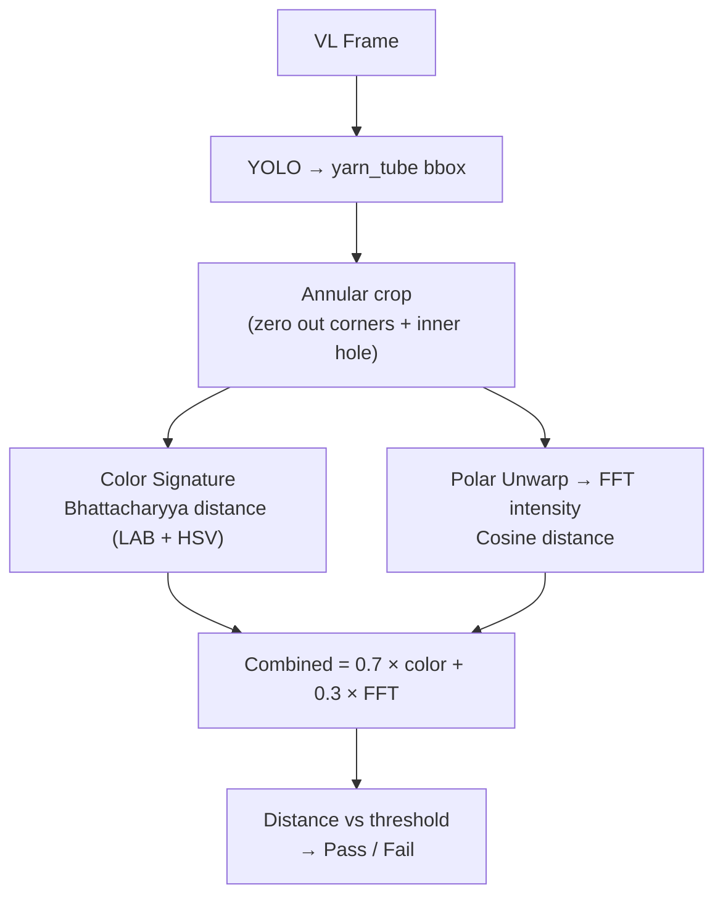

# Chapter 6: Tube Pattern Matching

## 6.1 Overview

Tube pattern matching verifies that the yarn winding pattern on a cone matches the expected pattern for its material. It uses a nearest-neighbor approach combining color histogram analysis (Bhattacharyya distance on LAB) with spatial frequency analysis (FFT on the linearized ring).

**Source:** `src/inspection/tube_pattern.py` — `TubePatternMatcher` class

**Production accuracy:** 99.85% (Color NN alone), 100% (Color + FFT on master data).

## 6.2 Algorithm Overview



## 6.3 Color Nearest Neighbor

### Preprocessing Pipeline

1. **Find radius** — locate object bounds, compute center and inscribed radius
2. **Bilateral filter** — edge-preserving smoothing (d=9, σ_color=75, σ_space=75)
3. **Convert to LAB** — CIELAB color space (perceptually uniform)
4. **Polar unwarp** — `cv2.warpPolar()` converts circular view to rectangular strip
5. **Sweet spot crop** — trim inner 10% and outer 10% of radius (edge artifacts)
6. **Extract signature** — 32×32 LAB a*b* histogram + HSV H-S histogram + mean L* + Shannon entropy

### Distance Computation

For each template, compute:

```
color_distance = 0.7 × bhatt(LAB_hist_live, LAB_hist_ref) + 0.3 × bhatt(HSV_hist_live, HSV_hist_ref)
L_penalty = 0.5 × |mean_L_live - mean_L_ref| / 100.0
total_color = color_distance + L_penalty
```

- **Bhattacharyya distance** — 0 = identical, 1 = no overlap
- **Lightness penalty** — compensates for illumination drift

## 6.4 FFT Nearest Neighbor

### Linearization

1. Extract annular ring from the tube crop
2. Polar unwarp to rectangular strip via `cv2.warpPolar()` (linear interpolation)
3. Remove black rows/columns → clean strip (~670×25 pixels)

### FFT Feature Extraction

1. Compute vertical mean intensity profile along the ring
2. Apply 1D FFT (magnitude only, first 64 coefficients)
3. L2-normalize the magnitude vector

**Key property:** FFT is perfectly shift-invariant — rotation of the cone only changes phase, not magnitude. This captures periodic patterns (stripes, triangles, checks) regardless of cone orientation.

### Distance

Cosine distance between live FFT features and reference: `1 - dot(a, b)` for L2-normalized vectors.

## 6.5 Combined Decision

```
combined_distance = (1 - fft_weight) × color_distance + fft_weight × fft_distance
                  = 0.7 × color + 0.3 × FFT
```

Falls back to color-only if FFT features are unavailable.

## 6.6 Verification Mode vs Classification Mode

### Verification Mode (default: `verification_mode=true`)

Computes distance to the **expected** template only (the one matching `material_id`). No scan across all templates.

- Faster (one comparison, not N)
- More reliable (no risk of incorrect nearest-neighbor match)
- Per-pattern threshold from `.npz` file

### Classification Mode (legacy: `verification_mode=false`)

Finds nearest template across **all** loaded templates. Applies gates:

- **Entropy gate** — `|live_entropy - nearest_entropy| < max_entropy_delta` (rejects structurally different patterns)
- **Distance gate** — `combined_distance < max_bhatt_distance` (rejects untaught patterns)

## 6.7 Per-Pattern Threshold

Each `.npz` template stores a `color_threshold` computed during teaching:

1. Compute pairwise combined distances across all teaching samples
2. Take the 99th percentile (p99)
3. Threshold = p99 × 1.5

This means the threshold adapts to each pattern's natural variation — tight patterns get tight thresholds, varied patterns get looser ones.

## 6.8 Template File Format

Templates are stored as `.npz` files in `sieger_data/masters/{material_id}.npz`:

| Key | Shape | Description |
|-----|-------|-------------|
| `color_hists` | (N, 32, 32) | Per-sample LAB a*b* histograms |
| `color_entropies` | (N,) | Per-sample Shannon entropy |
| `color_mean_Ls` | (N,) | Per-sample mean L* |
| `color_hist_mean` | (32, 32) | Mean histogram (reference) |
| `color_entropy_mean` | scalar | Mean entropy |
| `color_mean_L_mean` | scalar | Mean lightness |
| `hsv_hist_mean` | (32, 32) | Mean HSV H-S histogram |
| `resnet_feats` | (N, 2048) | Per-sample ResNet50 features |
| `resnet_mean_feat` | (2048,) | Mean ResNet feature vector |
| `fft_feats` | (M, 64) | Per-sample FFT magnitudes |
| `fft_mean_feat` | (64,) | Mean FFT feature vector |
| `color_threshold` | scalar | p99 × 1.5 threshold |
| `extend_count` | scalar | Number of extend operations |
| `n_references` | scalar | Total teaching samples |

## 6.9 ResNet50 Features (Monitoring Only)

A pretrained ResNet50 (ImageNet, classification head removed) extracts 2048-dim global feature vectors. These are logged for comparison but **not used in the pass/fail decision** — Color NN + FFT outperform ResNet on this task.

ResNet accuracy: 95.05% (vs 99.85% for Color NN alone).

## 6.10 Color Matching Submodules

The `src/inspection/color_matching/` package provides the preprocessing pipeline:

| Module | Function | Purpose |
|--------|----------|---------|
| `bilateral_filter.py` | `apply_bilateral_filter()` | Edge-preserving noise removal |
| `convert_lab.py` | `convert_to_lab()` | BGR → CIELAB conversion |
| `histogram_2d.py` | `compute_2d_histogram()` | 32×32 LAB a*b* histogram |
| `hsv_histogram.py` | `compute_hs_histogram()` | 32×32 HSV H-S histogram |
| `normalize_histogram.py` | `normalize_histogram_l1()` | L1 normalization (sum=1) |
| `entropy_2d.py` | `compute_2d_entropy()` | Shannon entropy of histogram |
| `mean_lightness.py` | `compute_mean_lightness()` | Mean L* for drift monitoring |
| `bhattacharyya_distance.py` | `compute_bhattacharyya_distance()` | Histogram similarity (0-1) |
| `find_object.py` | `find_object()` | Locate object bounding box |
| `find_radius.py` | `find_radius()` | Object center + inscribed radius |
| `unrolled.py` | `unroll_cone_tip()` | Polar unwarp via `cv2.warpPolar()` |
| `crop_sweet_spot.py` | `crop_polar_sweet_spot()` | Trim distorted edges (inner/outer 10%) |
| `get_signature.py` | `get_statistical_signature()` | Full signature: histogram + entropy + mean_L |
| `match_pattern.py` | `match_pattern()` | Compare live vs master (legacy standalone) |
| `preprocess_pipeline.py` | `preprocess_cone_tip()` | Full pipeline: filter → LAB → unwarp → crop |

## 6.11 Result Fields

```python
@dataclass
class TubePatternResult:
    color_nearest: str          # Nearest class by Bhattacharyya
    color_distance: float       # Distance to nearest
    color_match: bool           # combined_nearest == expected_class
    resnet_nearest: str         # Nearest by cosine (monitoring)
    resnet_distance: float      # Cosine distance (monitoring)
    resnet_match: bool          # (monitoring)
    expected_class: str         # material_id from PLC
    reference_loaded: bool      # Template loaded?
    combined_nearest: str       # Nearest by color+FFT
    combined_distance: float    # Weighted distance
    fft_distance: float         # FFT cosine distance
```

**`passed`** property: `reference_loaded AND color_match` (combined decision, not ResNet).

## 6.12 Configuration

```json
{
    "tube_pattern": {
        "template_dir": "data/templates/tube",
        "bilateral_d": 9,
        "bilateral_sigma_color": 75,
        "bilateral_sigma_space": 75,
        "inner_crop_pct": 0.10,
        "outer_crop_pct": 0.10,
        "inner_ratio": 0.80,
        "max_entropy_delta": 0,
        "max_bhatt_distance": 0.6,
        "fft_weight": 0.3,
        "verification_mode": false
    }
}
```

| Key | Default | Description |
|-----|---------|-------------|
| `fft_weight` | 0.3 | FFT contribution (0.3 = 30% FFT, 70% color) |
| `inner_ratio` | 0.80 | Inner hole radius as fraction of tube outer radius |
| `verification_mode` | false | true = distance to expected only; false = nearest-neighbor |
| `max_entropy_delta` | 0 | Entropy gate (0 = disabled) |
| `max_bhatt_distance` | 0.6 | Distance gate for classification mode |

## 6.13 Fusion Feature Logging

For classifier training, `TubePatternMatcher` logs 10 fusion features per inspection to a CSV:

```
timestamp, expected_class, bhatt_to_expected, bhatt_to_nearest, bhatt_margin,
cosine_to_expected, cosine_to_nearest, cosine_margin, live_entropy,
expected_entropy, entropy_delta, classifiers_agree, color_nearest,
resnet_nearest, match_flags, result
```

This data enables future fusion classifier training (e.g., logistic regression on all features).
