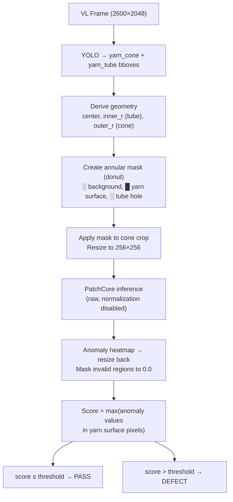

# Chapter 7: Stain Detection

## 7.1 Overview

Stain detection uses PatchCore (anomalib) unsupervised anomaly detection to identify surface contamination on yarn cones. The model learns what **normal** yarn surface looks like from 200+ good cones, then flags any deviation as a potential defect.

**Source:** `src/inspection/stain_detector.py` — `StainDetector` class

**Model:** PatchCore with WideResNet50 backbone (anomalib library)

## 7.2 Detection Pipeline



## 7.3 Annular Masking

The annular mask isolates the yarn surface from background and tube hole:

- **Outer mask** — `cv2.circle()` filled white at cone center with outer_r. Everything outside = black.
- **Inner mask** — `cv2.circle()` filled black at tube center with inner_r. Tube hole = black.
- Result: donut-shaped region where only yarn surface is white (scored).

This prevents PatchCore from scoring on:
- Image corners (background, not yarn)
- Tube center hole (always dark, would produce false anomalies)

## 7.4 PatchCore Configuration

### Normalization Disabled

```python
model.post_processor.enable_normalization = False
```

Anomalib's default min-max normalization saturates on small test sets. Raw scores are used instead, with a manually calibrated threshold.

### Threshold

- Default: `0.5` (config: `inspection.stain_threshold`)
- Set during installation using good cone score statistics
- Tuning: run `stain-detection/score_spread.py` on held-out good images, set threshold to 95th-99th percentile

## 7.5 Defects Detected

| Defect Type | Detection Confidence |
|-------------|---------------------|
| Color stains (oil, dye) | High |
| Dark spots / dirt | High |
| Thread contamination | High |
| Foreign material | High |
| Color variation / blotches | High |
| Labels / tape | Expected |

## 7.6 Fallback Detector

If the PatchCore model is not available, `_detect_fallback()` uses HSV-based thresholding:

1. Convert cone crop to HSV
2. Threshold V-channel (brightness < 80 = potential dark stain)
3. Morphological opening/closing (5×5 ellipse kernel)
4. Apply annular mask
5. Score = dark_pixels / total_pixels

This provides basic functionality during initial setup before PatchCore is trained.

## 7.7 Result Fields

```python
@dataclass
class StainResult:
    anomaly_score: float           # Max anomaly in yarn surface
    has_stain: bool                # score > threshold
    heatmap: Optional[np.ndarray]  # H×W float32 anomaly map
```

## 7.8 Training

### Minimum Requirements

- 200+ good cones (diverse batches, lighting conditions, materials)
- VL camera working with YOLO detection
- A100 cloud access for training

### Training Pipeline

1. **Capture** — Enable teach mode for stain: `PUT /config/teach { "stain_detection": true }`. Run 200+ good cones — system auto-captures stain crops. Disable teach mode when done: `PUT /config/teach { "stain_detection": false }`
2. **Upload** — `POST /cloud/upload` uploads 256×256 annular crops to Azure Blob
3. **Train** — Run on A100: PatchCore coreset construction (10-20 min for 500 samples)
4. **Deploy** — Download model, `POST /teaching/stain` with model_path, restart service

### Training Scripts

Located in `stain-detection/`:

| Script | Purpose |
|--------|---------|
| `prepare_dataset.py` | YOLO crops → 256×256 annular crops → MVTec dataset structure |
| `train.py` | Train PatchCore with anomalib |
| `score_spread.py` | Analyze score distribution, pick threshold |
| `evaluate_stains.py` | Verify on stain images before deploying |

### Retraining Triggers

| Situation | Action |
|-----------|--------|
| False positive rate > 2% | Increase threshold or retrain with more samples |
| Stains being missed | Decrease threshold or retrain |
| New yarn type / dye color | Retrain |
| Lighting changed (lamp replacement) | Retrain |
| Camera replaced / repositioned | Retrain from scratch |

## 7.9 Configuration

```json
{
    "inspection": {
        "patchcore_model": "models/patchcore",
        "stain_threshold": 0.5
    }
}
```

Model file: `models/patchcore/weights/torch/model.pt`

Requires `TRUST_REMOTE_CODE=1` environment variable (anomalib requirement).

## 7.10 Visualization

The stain heatmap is overlaid on the cone crop in the composite report image:

- JET colormap (blue = low anomaly, red = high)
- Blended only where heatmap > 0.3 (alpha = 0.4)
- Annular mask regions show as black (not scored)
