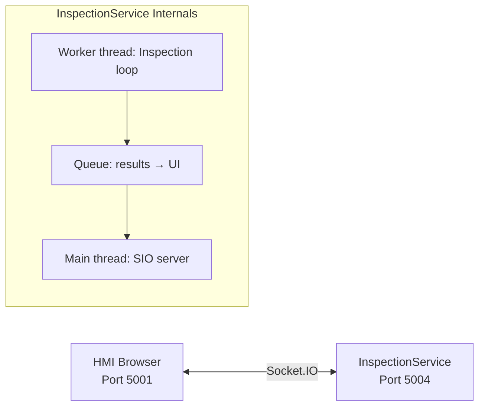

# Chapter 11: Socket.IO Service

## 11.1 Overview

The Socket.IO inspection service runs on port 5004 and provides real-time inspection control, live camera streaming, and event-driven communication with the HMI.

**Source:** `src/services/inspection_service.py` — `InspectionService` class

**Framework:** python-socketio + eventlet

**Port:** 5004

## 11.2 Architecture



- **Main thread** — Socket.IO server (eventlet), handles client events
- **Worker thread** — Inspection loop (polls PLC, captures images, runs inference, writes results)
- **Queue** — Results from worker thread → Socket.IO for streaming to UI
- **State** — All shared state protected by `threading.Lock`

## 11.3 State Machine

The service uses an `InspectionState` enum to track its current mode:

| State | Value | Description |
|-------|-------|-------------|
| `IDLE` | 0 | Waiting, no active operation |
| `CAPTURE` | 1 | Data capture mode (save images, no inspection) |
| `INSPECT` | 2 | Full inspection mode |
| `LIVE_FEED` | 3 | Stream camera feed to UI |
| `EXPOSURE` | 4 | Change camera exposure |
| `LIGHT_ON` | 5 | Turn PLC light relay on |
| `LIGHT_OFF` | 6 | Turn PLC light relay off |
| `LIGHT_STATUS` | 7 | Read light relay status |
| `ILLUM_CHECK_VL/UV/TAIL` | 8-10 | Illumination check per camera |
| `ILLUM_SAVE_VL/UV/TAIL` | 11-13 | Save illumination reference image |
| `PLC_CONFIG` | 14 | PLC configuration |
| `ERROR_PROOF` | 15 | Error proofing operations |

State transitions are thread-safe via `ServiceState.set_state()` / `get_state()`.

## 11.4 Client → Server Events

### start_inspection

Begin the inspection loop. Payload:

```json
{"type": "inspection"}   // or "capture", "trial"
```

- `"inspection"` — full inspection, results written to PLC
- `"trial"` — full inspection, results NOT written to PLC (monitoring only)
- `"capture"` — save images without inspection

### stop_inspection

Stop the current operation. Payload: `{}`.

### connect_cam

Request live camera frames. Payload:

```json
{"camera": "vl", "exposure": 11000}  // vl|uv|tail
```

### disconnect_cam

Stop live frame stream. Payload: `{"camera": "vl"}`.

### get_analytics

Request analytics snapshot. Payload: `{}`.

### reset_analytics

Reset shift counters. Payload: `{}`.

## 11.5 Server → Client Events

### frame

Emitted after each inspection cycle with the annotated report:

```json
{
    "camera": "report",
    "image": "<base64 JPEG>",
    "result": 1,
    "defect_type": 0,
    "material_id": "42",
    "timestamp": "2026-04-01T10:30:00Z",
    "modules": {
        "tube": {"result": 1, "distance": 0.12, "threshold": 0.35},
        "stain": {"result": 1, "score": 0.15},
        "uv": {"result": 1, "radial_dip": 0.008},
        "tail": {"result": 1},
        "dimension": {"result": 1, "cone_diameter_mm": 59.8, "tube_diameter_mm": 32.1}
    }
}
```

### teaching_alert

Auto-teaching progress or completion:

```json
// Progress
{"type": "progress", "material_id": "42", "captured": 12, "required": 20, "message": "Captured 12/20 for material 42"}

// Complete
{"type": "complete", "material_id": "42", "threshold": 0.18, "message": "Template 42.npz created."}
```

### analytics_snapshot

Response to `get_analytics`:

```json
{
    "ok": true,
    "data": {
        "shift": {
            "total": 500,
            "good": 480,
            "defect": 15,
            "error": 5,
            "rejection_rate_pct": 3.0
        },
        "per_material": {
            "42": { "total": 120, "good": 115, "defect": 5, "defect_types": { "stain": 3, "tube_mismatch": 2 } }
        },
        "session_total": 1200
    }
}
```

### analytics_reset

Response to `reset_analytics`:

```json
{"ok": true, "shift_start": "2026-04-01T06:00:00Z"}
```

## 11.6 Inspection Cycle

The worker thread runs `_run_inspection_cycle()` in a loop:

1. Flush stale camera buffers
2. Attempt inter-cycle camera reconnects on disconnected cameras
3. Write `cycle_start=1` to PLC (ready for next cone)
4. Poll PLC for trigger with material data + `c2c_start` mode
5. Check `c2c_start`: 0=disabled (skip), 1=normal, 2=trial
6. Check auto-teaching gate: if material has no `.npz` template → route to capture
7. Capture 3 images via `CaptureSequence`
8. Run `_inspect_and_report()` — full pipeline
9. Write results to PLC (skip in trial mode)
10. Stream report to UI via Socket.IO
11. Log to SQLite

## 11.7 Analytics

The `AnalyticsState` class tracks inspection metrics in-memory:

- **Shift counters** — total, good, defect, error within the current shift window
- **Per-material breakdown** — total/good/defect per material_id
- **Defect breakdown** — count by defect type (stain, pattern, uv, tail, dimension)
- **Session counters** — since service start

Shift resets automatically based on `shift_hours` setting from `config.json` (default 8.0 hours).

`AnalyticsState.snapshot()` returns a JSON-serializable dict including `rejection_rate_pct`.

## 11.8 Stream Configuration

```json
{
    "service": {
        "stream": {
            "report_width": 1280,
            "report_height": 720,
            "report_quality": 80,
            "live_width": 640,
            "live_height": 480,
            "live_quality": 70,
            "live_fps": 10
        }
    }
}
```

Report images are resized and JPEG-compressed before base64 encoding. Live feed runs at a separate (lower) resolution and quality.

## 11.9 PLC Reconnect Backoff

If the PLC connection drops during operation:

- Exponential backoff: 2s → 4s → 8s → 16s → 30s (capped)
- Resets to 2s on successful reconnect
- Prevents Modbus TCP retry spam on flaky networks
- Reconnect attempted between inspection cycles via `_try_plc_reconnect()`

## 11.10 Module Lazy Loading

Inspection modules (YOLO, PatchCore, TubePatternMatcher) are loaded lazily on first use:

- `_get_vl_inspector()` — loads `VisibleInspection` + GPU warmup (dummy inference)
- `_get_uv_inspector()` — loads `UVInspection` + GPU warmup
- `_get_tail_inspector()` — loads `TailInspection` + GPU warmup

Warmup runs a dummy inference to pre-compile GPU kernels, avoiding first-cone latency.

## 11.11 Mock Service

`MockInspectionService` (`src/services/mock_inspection_service.py`) inherits from `InspectionService` and overrides hardware initialization:

- `_init_cameras()` → creates `MockCamera` instances from image folders
- `_init_plc()` → creates `MockPLCClient`
- Adds 2s delay per cycle to simulate conveyor timing

Used for development/testing without real hardware.
