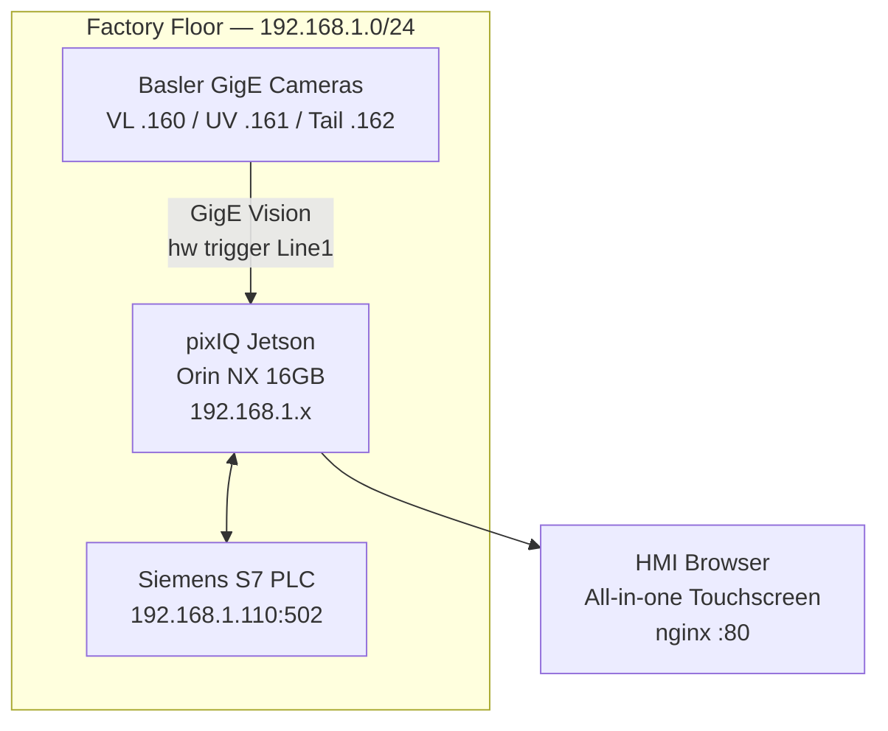

# Chapter 14: Deployment

## 14.1 Overview

The system runs as three native systemd services on Jetson Orin NX (pixIQ). No Docker — real-time latency requirements, direct kernel access for Basler GigE cameras, and Modbus TCP sensitivity to container NAT.

## 14.2 Services

| Service | Unit File | Port | Description |
|---------|-----------|------|-------------|
| sieger-inspection | sieger-inspection.service | 5004 | Socket.IO — live inspection loop |
| sieger-api | sieger-api.service | 5002 | FastAPI — teaching, recipes, results |
| sieger-report | sieger-report.service | 5001 | Node.js — HMI report UI |

Service files located in `deploy/systemd/`.

## 14.3 Network Topology



## 14.4 Nginx Reverse Proxy

Config in `deploy/nginx/sieger.conf`. Routes:

| Path | Backend | Purpose |
|------|---------|---------|
| `/` | `:5001` | HMI report UI |
| `/api/` | `:5002` | FastAPI REST |
| `/socket.io/` | `:5004` | Inspection Socket.IO |

## 14.5 Managing Services

```bash
# Start all
sudo systemctl start sieger-api sieger-inspection sieger-report

# Status
sudo systemctl status sieger-inspection

# Live logs
journalctl -u sieger-inspection -f

# Restart after config change
sudo systemctl restart sieger-api sieger-inspection

# Enable on boot
sudo systemctl enable sieger-api sieger-inspection sieger-report
```

### Convenience Script

`start_cv.sh`:
```bash
./start_cv.sh           # Start all services
./start_cv.sh --follow  # Start + tail logs
./start_cv.sh stop      # Stop all services
```

## 14.6 Pre-Deployment Checklist

- [ ] Hardware ready (Jetson Orin NX 16GB — pixIQ)
- [ ] JetPack 6.x flashed (includes CUDA, TensorRT, cuDNN)
- [ ] Basler GigE cameras mounted and cabled (VL: a2A2600-20gcPRO, UV: acA1920-40gc, Tail: a2A1920-40gc)
- [ ] PLC connected, Modbus TCP reachable (`ping 192.168.1.110`)
- [ ] Factory LAN switch connecting IPS host, PLC, and cameras
- [ ] HMI display configured (Chromium kiosk mode)
- [ ] Basler pylon .deb downloaded (ARM64) from baslerweb.com
- [ ] Azure CLI authenticated (for cloud upload)

## 14.7 System Setup Script

Run once on a fresh Jetson Orin NX. Installs all dependencies, configures GigE networking, and verifies the environment.

```bash
# Place pylon .deb in /tmp/pylon/ before running
mkdir -p /tmp/pylon
cp pylon_*.deb /tmp/pylon/

# Run setup
sudo ./scripts/system_setup.sh
```

**What it installs:**

| Category | What |
|----------|------|
| System packages | build-essential, cmake, nginx, sqlite3, ethtool, media libs |
| Dual NIC setup | Auto-detects factory LAN NIC vs internet NIC, warns on misconfiguration |
| GigE optimization | rmem_max=16MB, jumbo frames MTU 9000 (factory NIC only), disable offloading |
| Basler pylon SDK | From .deb in /tmp/pylon/ (+ environment vars) |
| TensorRT | Verifies JetPack TensorRT, installs if missing |
| Python | uv package manager, pypylon from source |
| Jetson perf | MAXN power mode, jetson_clocks locked, persisted |

**Dual NIC layout** (Jetson Orin NX has two Ethernet ports):
```
NIC 1 (factory LAN) → 192.168.1.x → cameras, PLC, HMI  [jumbo frames, MTU 9000]
NIC 2 (internet)    → DHCP         → Azure, SSH, apt    [default MTU 1500]
```

No software traffic prioritization needed — the two networks are physically separated.

**Configurable via environment variables:**
```bash
# Custom factory subnet + explicit NIC (default: auto-detect)
sudo FACTORY_SUBNET=192.168.1.0/24 FACTORY_NIC=eth0 ./scripts/system_setup.sh
```

The script is idempotent — safe to re-run.

## 14.8 Basler pylon SDK (ARM64 details)

pypylon does **not** have prebuilt ARM64 wheels on PyPI. The pylon Camera Software Suite must be installed first, then pypylon is built from source against it.

```bash
# 1. Download pylon SDK for ARM64 from Basler
#    https://www2.baslerweb.com/en/downloads/software-downloads/
#    Select: pylon Camera Software Suite → Linux ARM 64-bit → .deb package

# 2. Install pylon SDK
sudo dpkg -i pylon_*.deb
sudo apt-get install -f

# 3. Verify pylon installed
/opt/pylon/bin/PylonViewerApp  # GUI camera viewer (optional)

# 4. Install pypylon — builds from source against pylon SDK
pip install pypylon --no-binary pypylon

# 5. Verify pypylon
python -c "from pypylon import pylon; print(pylon.TlFactory.GetInstance().EnumerateDevices())"
```

**Note:** If `pip install pypylon` fails on ARM64, build from source:
```bash
git clone https://github.com/basler/pypylon.git
cd pypylon
pip install .
```

The pylon SDK is also needed for GigE Vision configuration tools (`PylonViewerApp`, `PylonIpConfigurator`) to assign static IPs to cameras during initial setup.

## 14.8 Deploy Code to Site

```bash
# Push code from dev machine to site
rsync -av --exclude='.venv' --exclude='__pycache__' --exclude='*.pyc' \
    ~/projects/yarncone/sieger/cone-transport-system-pixiq/ \
    sieger@<pixiq-ip>:~/sieger/

# SSH into pixIQ device
ssh sieger@<pixiq-ip>

# Install Python dependencies (pypylon must be installed separately, see 14.7)
cd ~/sieger
~/.local/bin/uv sync

# Edit config.json with site-specific values (camera IPs, PLC IP)
nano src/config.json
```

## 14.8 Site-Specific Configuration

Edit `src/config.json` before starting services:

```json
{
    "data_root": "/home/<username>/sieger_data",
    "plc": { "host": "<PLC IP>" },
    "cloud": {
        "provider": "azure",
        "account_name": "dhvanicvdvc",
        "container": "sieger-training",
        "customer_id": "<site_name>",
        "sas_token": "<SAS token>"
    }
}
```

**config.json contains the SAS token — never commit to git.**

### Generate Azure SAS Token

```bash
az storage container generate-sas \
    --name sieger-training \
    --account-name dhvanicvdvc \
    --permissions racwl \
    --expiry 2027-12-31 \
    --auth-mode key \
    --output tsv
```

Each site gets its own token (independent revocation).

## 14.9 Install Systemd Services

```bash
sudo cp deploy/systemd/sieger-inspection.service /etc/systemd/system/
sudo cp deploy/systemd/sieger-api.service /etc/systemd/system/
sudo systemctl daemon-reload
sudo systemctl enable sieger-inspection sieger-api
sudo systemctl start sieger-inspection sieger-api

# Install nginx
sudo cp deploy/nginx/sieger.conf /etc/nginx/sites-enabled/
sudo nginx -t && sudo systemctl restart nginx
```

## 14.10 TensorRT Model Export

YOLO models must be exported to TensorRT `.engine` format on the target Jetson device. TensorRT engines are GPU-architecture-specific — they cannot be exported on an x86 machine and deployed to Jetson.

```bash
# SSH into the pixIQ device
ssh sieger@<pixiq-ip>

# Navigate to project
cd ~/sieger

# Export all 3 YOLO models to TensorRT FP16
uv run python scripts/export_tensorrt.py

# Or export a specific model
uv run python scripts/export_tensorrt.py --model weights/visible_yolo.pt
```

This produces `.engine` files alongside the `.pt` files:

```
weights/
├── visible_yolo.pt        # PyTorch (original)
├── visible_yolo.engine    # TensorRT FP16 (generated)
├── uv_yolo.pt
├── uv_yolo.engine
├── yarn_tail_v3.pt
└── yarn_tail_v3.engine
```

**No config change needed.** The `YOLODetector` auto-detects `.engine` files — if a `.engine` exists alongside the configured `.pt` path, TensorRT is used automatically. Delete the `.engine` file to fall back to PyTorch.

Export takes 2–5 minutes per model on Orin NX. Run once after initial deployment and after any model retrain.

| Model | PyTorch (.pt) | TensorRT FP16 (.engine) | Speedup |
|-------|---------------|-------------------------|---------|
| YOLO VL | ~80ms | ~15ms | ~5x |
| YOLO UV | ~80ms | ~15ms | ~5x |
| YOLO Tail | ~80ms | ~15ms | ~5x |

**Prerequisites:**
- JetPack 6.x with TensorRT installed
- `ultralytics >= 8.4`
- CUDA available (`nvidia-smi` or `jtop`)

## 14.11 Application Initialization

On first start, `src/init_app.py` runs automatically:

1. Creates required directories: `data/db`, `data/recipes`, `data/templates/tube`, `weights`, `models`, `logs`
2. Initializes SQLite database with schema (version 5)
3. Migrates legacy SQLite materials to JSON recipes (one-time)
4. Enables WAL mode, foreign keys, `PRAGMA synchronous=NORMAL`

## 14.11 Data Storage Layout

All runtime data under `data_root`:

```
sieger_data/
├── masters/              # Tube pattern .npz templates
├── captures/             # Teaching capture sessions
│   ├── stain/
│   ├── uv/
│   ├── tail/
│   └── dimension/
├── audit/                # Per-inspection annotated JPEGs
│   └── YYYY/MM/DD/
├── db/
│   └── sieger.db         # SQLite database
└── models/
    └── patchcore/        # Trained stain model
```

## 14.12 Verify Deployment

```bash
# Services running?
sudo systemctl status sieger-inspection sieger-api

# API health?
curl http://localhost:5002/health

# PLC connected?
curl http://localhost:5002/health/plc

# Cameras connected?
curl http://localhost:5002/health/cameras

# Logs
journalctl -u sieger-inspection -f
journalctl -u sieger-api -f
```

## 14.13 Troubleshooting

| Issue | Check |
|-------|-------|
| HMI not loading | `systemctl status nginx`, `curl http://localhost:5002/health` |
| PLC not connecting | config.json IP correct, `ping <plc-ip>` |
| Camera not found | pypylon installed, IPs in config.json correct, `ping <camera-ip>` |
| Cloud upload fails | SAS token expiry, token not revoked |
| Service crash on start | `journalctl -u sieger-api -n 50` |
| GPU not detected | `nvidia-smi`, check driver installation |

## 14.14 No Docker Policy

Docker is explicitly excluded. Reasons:

1. Real-time latency — no container networking overhead
2. Basler GigE camera drivers require direct kernel access
3. Modbus TCP latency sensitive to container NAT
4. systemd restart policies handle crash recovery adequately
