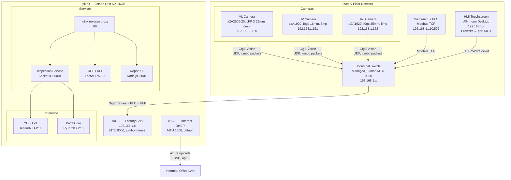
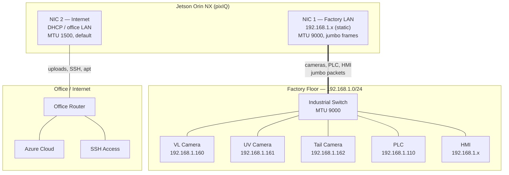

# Chapter 17: pixIQ System Setup

First-time hardware and software setup for the Jetson Orin NX (pixIQ) platform.

## 17.1 Hardware Overview

### pixIQ Network Architecture



### Component Table

| Component | Model | Connection | IP | Role |
|-----------|-------|------------|-----|------|
| pixIQ | Jetson Orin NX 16GB | — | 192.168.1.x (factory), DHCP (internet) | Compute + inference |
| VL Camera | a2A2600-20gcPRO | GigE → switch | 192.168.1.160 | Visible light, side view (2600x2048, 25mm, 6mp) |
| UV Camera | acA1920-40gc | GigE → switch | 192.168.1.161 | UV light, side view (1920x1200, 16mm, 5mp) |
| Tail Camera | a2A1920-40gc | GigE → switch | 192.168.1.162 | Yarn tail, top-down (1920x1200, 25mm, 5mp) |
| PLC | Siemens S7 | Ethernet → switch | 192.168.1.110 | Conveyor control, Modbus TCP :502 |
| HMI | All-in-one touchscreen | Ethernet → switch | 192.168.1.x | Operator interface, Chromium browser |
| Switch | Industrial managed | — | — | Jumbo frame support required (MTU 9000) |

### Dual NIC Layout

The Jetson Orin NX has two Ethernet ports — used for physical traffic separation:



Camera traffic and internet traffic never share a wire — no software prioritization needed.

## 17.2 Prerequisites

Before running setup:

- [ ] Jetson Orin NX flashed with JetPack 6.x (includes CUDA, TensorRT, cuDNN)
- [ ] Both Ethernet ports cabled (factory LAN + internet)
- [ ] Industrial switch supports jumbo frames (MTU 9000)
- [ ] Basler pylon SDK `.deb` downloaded from [baslerweb.com](https://www2.baslerweb.com/en/downloads/software-downloads/) (Linux ARM 64-bit)
- [ ] Cameras physically mounted and powered

## 17.3 Running system_setup.sh

```bash
# Place pylon .deb in /tmp/pylon/
mkdir -p /tmp/pylon
cp pylon_*_arm64.deb /tmp/pylon/

# Run setup (takes ~5 minutes)
chmod +x scripts/system_setup.sh
sudo ./scripts/system_setup.sh
```

### What it does

| Step | Category | Details |
|------|----------|---------|
| 1 | System packages | build-essential, cmake, nginx, sqlite3, ethtool, media libs |
| 2 | GigE network | Kernel buffers (rmem_max=16MB), jumbo frames (MTU 9000) on factory NIC only, disable offloading |
| 3 | Basler pylon SDK | Install from .deb, set `/opt/pylon` environment |
| 4 | TensorRT | Verify JetPack TensorRT is available |
| 5 | Python | Install uv, create sieger user, build pypylon from source |
| 6 | Jetson performance | MAXN power mode, jetson_clocks locked + systemd persistence |
| 7 | Verification | Print summary table with status of all components |

### Environment variables

| Variable | Default | Purpose |
|----------|---------|---------|
| `FACTORY_SUBNET` | `192.168.1.0/24` | Factory LAN subnet for NIC auto-detection |
| `FACTORY_NIC` | auto-detect | Factory LAN NIC (detected from subnet) |
| `SIEGER_USER` | `sieger` | System user for running services |
| `INSTALL_DIR` | `/opt/sieger` | Application install directory |
| `PYLON_DEB_DIR` | `/tmp/pylon` | Directory containing pylon `.deb` file |

```bash
# Example: custom factory subnet
sudo FACTORY_SUBNET=192.168.1.0/24 ./scripts/system_setup.sh
```

## 17.4 Network Configuration

### Factory NIC — Jumbo Frames

The setup script enables MTU 9000 on the factory LAN NIC. This reduces the number of UDP packets per camera frame by ~6x:

| MTU | Packets per 5MP frame (~5MB) | CPU overhead |
|-----|------------------------------|-------------|
| 1500 (default) | ~3,500 packets | High — interrupt per packet |
| 9000 (jumbo) | ~580 packets | Low — 6x fewer interrupts |

**All devices on the factory LAN must support jumbo frames:**

| Device | How to enable jumbo |
|--------|-------------------|
| Industrial switch | Management interface → port settings → MTU 9000 |
| Basler cameras | Automatic — `GevSCPSPacketSize=8192` set by camera driver |
| Jetson NIC 1 | Automatic — set by `system_setup.sh` |
| PLC | Usually supports jumbo by default, no change needed |
| HMI desktop | Optional — no large packet traffic from HMI |

If the switch doesn't support jumbo frames, the system still works at MTU 1500 — just with higher CPU load on the Jetson.

### Internet NIC — Default Settings

The internet NIC keeps standard MTU 1500. No special configuration needed — used for:
- Azure blob uploads (teaching images, audit data)
- SSH access for remote debugging
- System updates (`apt upgrade`)

### GigE Tuning Applied by Setup Script

| Setting | Value | Why |
|---------|-------|-----|
| `net.core.rmem_max` | 16MB | Kernel receive buffer for camera UDP streams |
| `net.core.rmem_default` | 16MB | Default for new sockets |
| `net.core.netdev_max_backlog` | 10000 | Queue depth for burst traffic (3 cameras) |
| MTU | 9000 | Jumbo frames — fewer packets per frame |
| GRO/GSO/TSO | off | Disable offloading — prevents GVSP reordering |
| rx-usecs | 0 | Disable interrupt coalescing — lowest latency |

## 17.5 Camera IP Assignment

After pylon SDK is installed, assign static IPs to cameras:

```bash
# GUI tool (if display available)
/opt/pylon/bin/PylonIpConfigurator

# Or from Python
python3 -c "
from pypylon import pylon
tl = pylon.TlFactory.GetInstance()
for d in tl.EnumerateDevices():
    print(f'{d.GetModelName()} | {d.GetSerialNumber()} | {d.GetIpAddress()}')
"
```

Assign IPs matching `config.json`:

| Camera | Model | IP |
|--------|-------|----|
| VL | a2A2600-20gcPRO (25mm, 6mp) | 192.168.1.160 |
| UV | acA1920-40gc (16mm, 5mp) | 192.168.1.161 |
| Tail | a2A1920-40gc (25mm, 5mp) | 192.168.1.162 |

**Important:** Use the Pylon IP Configurator to set **persistent** static IPs (stored in camera flash). Temporary IPs (ForceIP) reset on power cycle.

## 17.6 TensorRT Model Export

After cameras and network are configured, export YOLO models to TensorRT:

```bash
cd /opt/sieger
uv venv --python 3.10 --system-site-packages
uv sync
uv run python scripts/export_tensorrt.py
```

This produces `.engine` files alongside the `.pt` weights. The `YOLODetector` auto-detects them — no config change needed.

See [Chapter 14 — Deployment](14_deployment.md) section 14.10 for details.

## 17.7 Jetson Performance Settings

The setup script configures the Jetson for maximum performance:

| Setting | Value | Why |
|---------|-------|-----|
| Power mode | MAXN | All CPU/GPU cores at maximum frequency |
| jetson_clocks | locked | Prevents clock throttling under sustained load |
| Desktop GUI | recommend disable | Frees ~500MB RAM for inference |

To disable the desktop GUI (recommended — HMI runs on a separate screen):

```bash
sudo systemctl set-default multi-user.target
sudo reboot
```

To re-enable if needed:

```bash
sudo systemctl set-default graphical.target
sudo reboot
```

## 17.8 Verification

After setup, verify the full stack:

```bash
# 1. Check cameras are reachable
ping -c 1 192.168.1.160  # VL
ping -c 1 192.168.1.161  # UV
ping -c 1 192.168.1.162  # Tail

# 2. Check PLC is reachable
ping -c 1 192.168.1.110

# 3. Check pylon can see cameras
python3 -c "
from pypylon import pylon
tl = pylon.TlFactory.GetInstance()
devs = tl.EnumerateDevices()
print(f'Found {len(devs)} camera(s)')
for d in devs:
    print(f'  {d.GetModelName()} @ {d.GetIpAddress()}')
"

# 4. Check TensorRT engines exist
ls -la weights/*.engine

# 5. Check jumbo frames on factory NIC
ip link show | grep mtu

# 6. Start services and check health
sudo systemctl start sieger-inspection sieger-api
curl http://localhost:5002/health
```

## 17.9 Troubleshooting

| Issue | Check |
|-------|-------|
| Camera not found by pylon | `ping <camera-ip>`, verify MTU matches on switch, check factory NIC is up |
| Jumbo frames not working | Switch must support MTU 9000 — check switch management UI |
| pypylon import fails | Verify pylon SDK installed: `ls /opt/pylon`, rebuild: `pip install pypylon --no-binary pypylon` |
| TensorRT export fails | Verify: `python3 -c "import tensorrt"`, check JetPack version with `jtop` |
| Camera frame drops | Check `get_stream_statistics()` — look at `missed`, `resend_requests`. May need to increase `GevSCPD` (inter-packet delay) |
| PLC Modbus timeout | Verify PLC IP in config.json, check factory NIC routing: `ip route get 192.168.1.110` |
| GPU not detected | `nvidia-smi` or `jtop`, check user is in `video` and `render` groups |
| Internet NIC not working | Check default route: `ip route show default` — should use NIC 2 |
| Both NICs on same subnet | Misconfiguration — factory LAN and internet must be different subnets |
