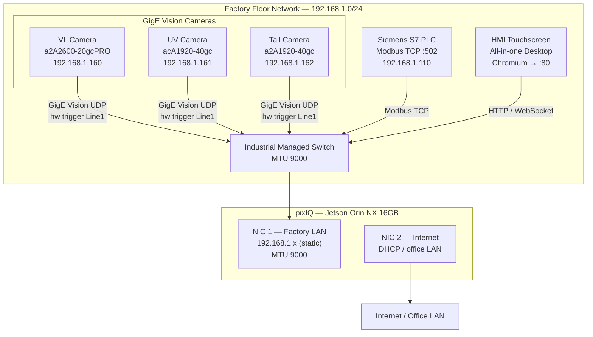
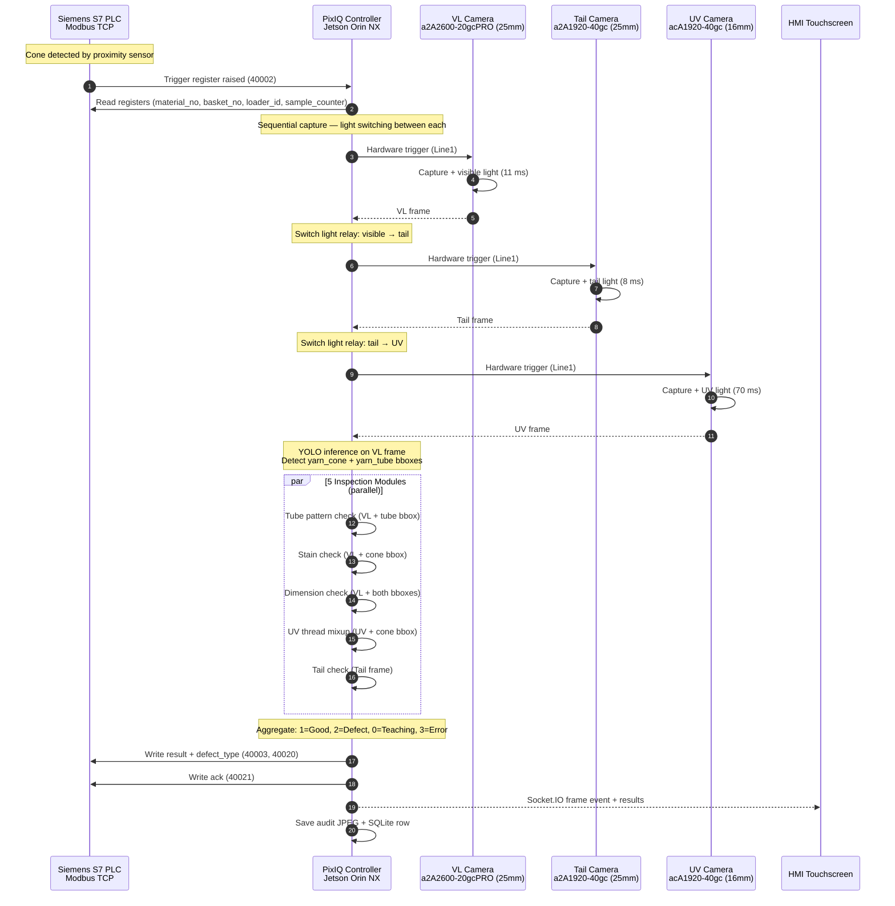

# Project Context — Sieger pixIQ Yarn Cone Inspection System v3.0.0

> **Canonical reference for the full pipeline.** Read this before making any code changes.
> Last updated: 2026-04-14

---

## Table of Contents

1. [System Overview](#1-system-overview)
2. [Inspection Pipeline](#2-inspection-pipeline)
3. [Five Inspection Modules](#3-five-inspection-modules)
4. [Teaching System](#4-teaching-system)
5. [material_id as Global Truth](#5-material_id-as-global-truth)
6. [PLC Communication](#6-plc-communication)
7. [Camera Acquisition](#7-camera-acquisition)
8. [Data Storage](#8-data-storage)
9. [Services Architecture](#9-services-architecture)
10. [Config Reference](#10-config-reference)

---

## 1. System Overview

The Sieger pixIQ Yarn Cone Inspection System is a real-time machine vision system deployed on the factory floor. It inspects yarn cones coming off the spinning machine for defects across five independent checks: tube pattern, stain, UV thread mixup, tail yarn presence, and cone/tube dimensions.

### Hardware

| Component | Spec |
|-----------|------|
| Compute | NVIDIA Jetson Orin NX 16GB (ARM64, JetPack 6.x) |
| OS | Ubuntu 22.04 LTS (L4T) |
| VL Camera | Basler a2A2600-20gcPRO (2600×2048, 25mm lens) — 192.168.1.160 |
| UV Camera | Basler acA1920-40gc (1920×1200, 16mm lens) — 192.168.1.161 |
| Tail Camera | Basler a2A1920-40gc (1920×1200, 25mm lens) — 192.168.1.162 |
| Camera SDK | pypylon (Basler pylon) |
| Inference | TensorRT FP16 (auto-built), PyTorch FP16 fallback |
| PLC | Siemens S7, Modbus TCP (192.168.1.110:502) |
| HMI | Separate all-in-one touchscreen desktop |
| Network | Dedicated 192.168.1.0/24 subnet, MTU 9000 (jumbo frames) |

### Network Topology

See also: [`docs/diagrams/pixiq_network.mmd`](diagrams/pixiq_network.mmd) for the full styled diagram.



### Service Ports

| Service | Port | Protocol | Purpose |
|---------|------|----------|---------|
| FastAPI backend | 5002 | HTTP + REST | Config, teaching, results API |
| Inspection service | 5004 | Socket.io | Live frames, inspection events |
| Report service | 5001 | HTTP | Node.js HMI report UI |

---

## 2. Inspection Pipeline

Each inspection cycle is triggered by the PLC raising the trigger register. The pipeline is fully sequential — no parallel camera acquisition.

### Step-by-Step Pipeline

See also: [`docs/diagrams/inspection_sequence.mmd`](diagrams/inspection_sequence.mmd) for the full sequence diagram.



### Timing Budget

| Step | Target | Notes |
|------|--------|-------|
| VL exposure | 11 ms | Hardware-triggered |
| Tail exposure | 8 ms | Sequential after VL |
| UV exposure | 70 ms | Longest — dominates |
| YOLO inference | ~15 ms | Jetson Orin NX TensorRT FP16 |
| 5 modules (parallel) | ~50 ms | Thread pool |
| PLC write + ack | <5 ms | Modbus TCP |
| **Total cycle** | **~180 ms** | Within PLC inter-cone gap |

Sequential imaging rationale: light switching (VL → tail light → UV light) requires settling time. Cameras are fired one after another with light relay switching between captures.

---

## 3. Five Inspection Modules

### 3.1 Tube Pattern Check

**Purpose:** Verify the yarn winding pattern on the tube matches the expected pattern for this material.

**Algorithm:**
1. Extract annular tube crop from VL frame using `yarn_tube` YOLO bbox
2. Resize to 256×256
3. Run Color NN — encodes color histogram features
4. Run FFT NN — encodes spatial frequency features
5. Compute combined distance to template in feature space
6. Compare distance vs per-pattern threshold (`p99_self_distance * 1.5`)

**Threshold:** Per-pattern, stored inside `.npz` file. Computed as `p99 of self-distances * 1.5` during teaching.

**Template file:** `/home/msiegerips/sieger_data/masters/{material_id}.npz`

**Result fields:** `tube_pattern_result`, `tube_distance`, `tube_threshold`

**Teaching:** Autonomous (see Section 4.1).

---

### 3.2 Stain Check (PatchCore)

**Purpose:** Detect surface contamination (oil stains, grease, foreign matter) on the yarn cone body.

**Algorithm:**
1. Extract annular cone crop from VL frame using `yarn_cone` YOLO bbox
2. Resize to 256×256
3. Run PatchCore anomaly detection (patch-level embedding, coreset memory bank)
4. Anomaly score = max patch score across the crop
5. Compare vs `stain_threshold` from config

**Threshold:** Configured in `config.json → stain_inspection.threshold`. Set during installation using good cone statistics.

**Model file:** `config.json → stain_inspection.model_path` (typically `models/patchcore/`)

**Crop saved for training:** 256×256 annular cone crop, saved to `sieger_data/captures/stain/{session_id}/`

**Result fields:** `stain_result`, `stain_score`, `stain_threshold`

**Teaching:** Operator-triggered at installation. Minimum 200 good cones. Retraining on A100 cloud.

---

### 3.3 UV Thread Mixup Check

**Purpose:** Detect polymer fiber mixup (wrong material blended in). Polymer mixup causes abnormal UV fluorescence pattern.

**Algorithm:**
1. Extract annular cone region from UV camera frame using `yarn_cone` bbox
2. Compute per-pixel `log(G / B)` ratio (natural log, with guard: `G > 0`)
3. Bin into 100 radial bins from cone center
4. Fit degree-2 polynomial baseline to radial profile
5. Compute `max_dip = max(baseline - profile)` — maximum negative deviation
6. Decision: `has_mixup = (max_dip > radial_dip_threshold)`

**Threshold:** `radial_dip_threshold = 0.024` (config: `uv_inspection.radial_dip_threshold`)

**Physics rationale:** Polymer mixup creates concentric fluorescence bands visible as a local dip in the radial log(G/B) profile. Pure yarn has a smooth monotonic profile.

**NaN guard:** `valid_mask = (G > 0) & (B > 0)` — prevents `log(0)` = `-inf` propagating as NaN through polyfit → silent Good verdict.

**No training required.** Threshold is physics-based. Recalibrate only if camera is replaced.

**Result fields:** `uv_result`, `radial_dip`, `gb_ratio` (monitoring only)

---

### 3.4 Tail Yarn Check

**Purpose:** Verify that the yarn tail (free end) is present. Missing tail = operator must re-thread machine.

**Algorithm:**
1. Use dedicated Tail camera frame (top-down view, tail light)
2. Run YOLO `yarn_tail` detector on full frame
3. If no `yarn_tail` bbox detected → defect (missing tail)
4. If detection confidence below threshold → treated as no detection

**Model file:** `weights/yarn_tail_v3.pt`

**Consecutive failure guard:** After 5 consecutive `detection_failed` results, `logger.error()` fires (hardware/model issue, not a real defect).

**Crop saved for training:** Top 60% of tail frame, saved to `sieger_data/captures/tail/{session_id}/`

**Result fields:** `tail_result`, `tail_detection_confidence`, `detection_failed`

**Teaching:** YOLO trained offline. POST `/teaching/tail` triggers retraining on captured tail images.

---

### 3.5 Dimension Check

**Purpose:** Verify cone outer diameter and tube diameter are within global site tolerances.

**Algorithm:**
1. Use YOLO `yarn_cone` and `yarn_tube` bboxes from VL frame
2. Apply `pixels_per_mm` calibration factor (from dimension teaching)
3. Compute `cone_diameter_mm = cone_bbox_width_px / pixels_per_mm`
4. Compute `tube_diameter_mm = tube_bbox_width_px / pixels_per_mm`
5. Compare vs `[nominal - tolerance, nominal + tolerance]` for each

**Calibration:** `pixels_per_mm` measured from calibration board at installation.

**Scope:** Global for all materials — one set of tolerances for the entire site. Not per-material.

**Config keys:**
```json
"dimension_inspection": {
    "cone_diameter_mm": 230.0,
    "cone_tolerance_mm": 5.0,
    "tube_diameter_mm": 42.0,
    "tube_tolerance_mm": 2.0,
    "pixels_per_mm": 1.45
}
```

**Result fields:** `dimension_result`, `cone_diameter_mm`, `tube_diameter_mm`, `cone_pass`, `tube_pass`

---

## 4. Teaching System

Teaching is the process of configuring each inspection module with site-specific reference data. Some modules are autonomous (no operator action), some are operator-triggered.

### 4.1 Tube Teaching — Fully Autonomous

**Trigger:** System sees an unknown `material_id` (no matching `{material_id}.npz` in masters/).

**Flow:**
```
Unknown material_id detected
        │
        ▼
result=0 written to PLC (teaching cone — no pass/fail)
Auto-capture begins: save 256×256 annular tube crops
        │
        ▼  (after tube_min_capture=20 samples)
Background thread: TubeTeacher.teach(pre_cropped=True)
→ Trains Color NN + FFT NN on 20 crops
→ Computes p99 self-distance → threshold = p99 * 1.5
→ Saves {material_id}.npz to masters/
        │
        ▼
Hot-load: new template loaded without service restart
System begins scoring cones of this material_id
```

**Operator action required:** None. The operator sees `teaching_alert` socket.io events on HMI showing progress (e.g., "Captured 12/20 for material 42").

**Manual retrigger:** POST `/teaching/tube` or POST `/teaching/tube/extend` to force re-teach with more samples.

**Config key:** `tube_teaching.tube_min_capture` (default: 20)

---

### 4.2 Stain Teaching — Operator Triggered (Installation + Periodic)

**When:** Installation (first time), or after major production change (new yarn type, lighting change).

**Flow:**
1. Operator triggers POST `/capture/start` with `module=stain`
2. Run ≥200 known-good cones through machine
3. POST `/capture/stop`
4. POST `/cloud/upload` → uploads 256×256 annular crops to Azure Blob (container: `sieger-training`)
5. Training runs on A100 cloud (PatchCore coreset construction)
6. Download trained model, update `config.json → stain_inspection.model_path`
7. POST `/restart` to load new model

**Minimum samples:** 200 good cones for a reliable coreset.

**Saved crops:** `sieger_data/captures/stain/{session_id}/` — 256×256 annular cone crops.

---

### 4.3 UV Teaching — Installation Only (No Training)

**When:** Installation. Recalibrate only if UV camera is replaced.

**Flow:**
1. Run 10+ good cones under UV camera
2. POST `/teaching/uv` — system measures `radial_dip` on good cones
3. Threshold set to `max(good_dips) + 0.005` or kept at default 0.024
4. Update `config.json → uv_inspection.radial_dip_threshold`

**No model training.** UV uses a physics-based algorithm. Threshold is a scalar in config.

**Verification:** POST `/health/cameras` → check UV camera is connected and returning valid frames.

---

### 4.4 Tail Teaching — Installation + Retrain if YOLO Degrades

**When:** Installation. Retrain if false-positive rate increases (YOLO detecting tail when absent).

**Flow:**
1. POST `/capture/start` with `module=tail` — captures top-60% of tail frames
2. Run cones with and without tails (labeled by operator)
3. POST `/capture/stop`
4. POST `/teaching/tail` → triggers YOLO retraining on captured tail images
5. New `yarn_tail_v3.pt` weights downloaded, service restarted

**Saved crops:** `sieger_data/captures/tail/{session_id}/` — top 60% of tail frame.

---

### 4.5 Dimension Teaching — Installation Only (Once Per Site)

**When:** Physical installation — after camera mounting is fixed.

**Flow:**
1. Place calibration board in field of view
2. POST `/teaching/dimension` with body:
   ```json
   {
     "cone_diameter_mm": 230.0,
     "cone_tolerance_mm": 5.0,
     "tube_diameter_mm": 42.0,
     "tube_tolerance_mm": 2.0,
     "pixels_per_mm": 1.45
   }
   ```
3. Config updated, service restart not required (values applied immediately)

**Global scope:** One calibration covers all materials. Camera mounting must not change after calibration.

---

## 5. material_id as Global Truth

### v3.0.0 Decision

In v3.0.0, `material_id` (integer, sent by PLC as string in register 40009) is the **single source of truth** for all material identity. There is no longer a `master_id` lookup or `RecipeStore`.

### Why This Change

Previously, the system maintained a `RecipeStore` mapping PLC `material_no` → internal `master_id` → template filename. This created a two-level indirection:
- PLC sends `material_no=42`
- System looks up `master_id` in RecipeStore
- Template loaded as `{master_id}.npz`

This caused: sync bugs when RecipeStore and PLC got out of step, operator confusion about which ID to use, and extra state to maintain.

### v3.0.0 Rule

```
PLC material_no = 42
    ↓
material_id = "42"
    ↓
Template file = masters/42.npz
    ↓
SQLite row: material_id = "42"
```

No lookup. No mapping. The integer the PLC sends IS the template name.

### Implications

- `material_no=0` from PLC = empty basket = skip inspection, do not overwrite material_id
- Tube template filename = `{material_id}.npz` always
- All DB queries use `material_id` column (string "42", not integer 42)
- There is no PUT /config — material configurations are not stored in the system (only templates)

---

## 6. PLC Communication

### Connection

- Protocol: Modbus TCP
- PLC IP: `192.168.1.110`
- Port: `502`
- pixIQ IP: `192.168.1.x` (static, factory LAN NIC)

### Register Map (Holding Registers, Base 0, Offset 40001)

#### Input Registers (PLC → PC)

| Register | Address (base 0) | Name | Values |
|----------|-----------------|------|--------|
| 40001 | 0 | sample_counter | Incrementing cone count |
| 40002 | 1 | trigger | 0=idle, 1=triggered |
| 40008 | 7 | c2c_start | 0=disabled, 1=normal, 2=trial |
| 40009 | 8 | material_no | Integer material ID |
| 40012 | 11 | basket_no | Basket number |
| 40013 | 12 | loader_id | Loader/spindle ID |

#### Light Control Registers (PC → PLC, PC controls relays)

| Register | Address (base 0) | Name |
|----------|-----------------|------|
| 40005 | 4 | uv_light |
| 40006 | 4 | vl_light |
| 40007 | 6 | yarntail_light |

#### Output Registers (PC → PLC)

| Register | Address (base 0) | Name | Values |
|----------|-----------------|------|--------|
| 40003 | 2 | result | 0=Teaching, 1=Good, 2=Defect, 3=Error |
| 40010 | 9 | cycle_start | Written 1 at start of cycle |
| 40015 | 14 | camera_error | 0=OK, 1=camera fault |
| 40016 | 15 | ips_status | 1=Active, 2=Trial, 3=Disabled |
| 40017 | 16 | basket_no_echo | Echo of basket_no read |
| 40018 | 17 | material_no_echo | Echo of material_no read |
| 40019 | 18 | loader_no_echo | Echo of loader_id read |
| 40020 | 19 | defect_type | See defect type codes below |
| 40021 | 20 | ack | Written to acknowledge cycle complete |

### Defect Type Codes

| Code | Meaning |
|------|---------|
| 0 | Good / No defect |
| 1 | Stain |
| 2 | Wrong pattern (tube) |
| 3 | Wrong cone diameter |
| 4 | Wrong tube diameter |
| 5 | Missing tail |
| 6 | Thread mixup (UV) |

### Handshake Sequence

```
PLC writes trigger=1 (40002)
        │
        ▼
pixIQ reads trigger, reads material_no, basket_no, loader_id
pixIQ writes cycle_start=1 (40010)
        │
        ▼
[Camera acquisition + inspection runs]
        │
        ▼
pixIQ writes result (40003)
pixIQ writes defect_type (40020)
pixIQ writes echo registers (40017-40019)
pixIQ writes ack=1 (40021)
        │
        ▼
PLC reads result + ack
PLC clears trigger=0
pixIQ clears ack=0
```

### PLC Reconnect Policy

On connection loss: exponential backoff starting at 2s, doubling each attempt, capped at 30s. Resets to 2s on successful reconnect. Prevents Modbus TCP retry spam on flaky networks.

---

## 7. Camera Acquisition

### Camera Table

| Camera | Model | Lens | IP | Exposure | Light Relay | View |
|--------|-------|------|----|----------|-------------|------|
| VL | a2A2600-20gcPRO | 25 mm | 192.168.1.160 | 11 ms | 40006 | Side view of cone |
| UV | acA1920-40gc | 16 mm | 192.168.1.161 | 70 ms | 40005 | Side view under UV |
| Tail | a2A1920-40gc | 25 mm | 192.168.1.162 | 8 ms | 40007 | Top-down, yarn tail |

### Acquisition Sequence

Cameras fire sequentially due to light switching requirements:

```
1. Switch ON: VL light relay
   Fire VL camera (11ms exposure)
   Receive VL frame
   Switch OFF: VL light

2. Switch ON: Tail light relay
   Fire Tail camera (8ms exposure)
   Receive Tail frame
   Switch OFF: Tail light

3. Switch ON: UV light relay
   [Wait for UV light to stabilize ~10ms]
   Fire UV camera (70ms exposure)
   Receive UV frame
   Switch OFF: UV light
```

UV light dominates cycle time due to 70ms exposure and stabilization.

### Camera Health Monitoring

- `GET /health/camera/{name}` returns per-camera status
- Inter-cycle health check: before `cycle_start`, pixIQ calls `cam.health_check()` + `cam.reconnect()` on any disconnected camera
- 5 consecutive detection failures in UV → `logger.error()` fires (camera issue, not defect)
- `camera_error` register (40015) written to PLC on persistent camera fault

### Basler GigE Vision

- SDK: Basler pypylon (ARM64: install pylon SDK first, then `pip install pypylon --no-binary pypylon`)
- Hardware trigger: Line1 rising edge, 200 µs debounce
- Grab strategy: `GrabStrategy_LatestImageOnly` — auto-discards stale frames
- Buffer management: pypylon manages buffers internally (`MaxNumBuffer = 5`)
- Frame grab timeout: configurable (default 2000ms)
- GigE optimization: jumbo frames (MTU 9000), packet size 8192, inter-packet delay 1000 ticks

---

## 8. Data Storage

### Root Directory

All runtime data lives under: `/home/msiegerips/sieger_data/`

### Directory Layout

```
sieger_data/
├── masters/                    # Tube pattern templates
│   ├── 42.npz                  # material_id=42 template
│   ├── 43.npz
│   └── ...
├── captures/                   # Teaching capture sessions
│   ├── stain/
│   │   └── {session_id}/       # 256×256 annular cone crops (VL)
│   ├── uv/
│   │   └── {session_id}/       # 256×256 annular cone crops (UV)
│   ├── tail/
│   │   └── {session_id}/       # Top 60% of tail frame
│   └── dimension/
│       └── {session_id}/       # Full VL frame
├── audit/                      # Per-inspection audit images
│   └── YYYY/MM/DD/
│       └── {inspection_id}.jpg # Annotated JPEG with bboxes + result
├── db/
│   └── sieger.db               # SQLite database
└── models/
    └── patchcore/              # Trained stain model
```

### Module-Specific Crop Saving

| Module | Crop Area | Size | Location |
|--------|-----------|------|----------|
| Stain | Annular cone region (VL) | 256×256 | captures/stain/ |
| UV | Annular cone region (UV) | 256×256 | captures/uv/ |
| Tail | Top 60% of tail frame | Full width × 60% height | captures/tail/ |
| Dimension | Full VL frame | Native resolution | captures/dimension/ |
| Tube | Annular tube region (VL) | 256×256 | Auto-deleted after teach |

### SQLite Tables

#### `inspections`

| Column | Type | Description |
|--------|------|-------------|
| id | INTEGER PK | Auto-increment |
| timestamp | TEXT | ISO-8601 datetime |
| material_id | TEXT | PLC material_no as string |
| basket_no | INTEGER | Basket number |
| loader_id | INTEGER | Loader/spindle ID |
| result | INTEGER | 0=Teaching, 1=Good, 2=Defect, 3=Error |
| defect_type | INTEGER | Defect type code (0-6) |
| tube_result | INTEGER | Per-module result |
| stain_result | INTEGER | Per-module result |
| uv_result | INTEGER | Per-module result |
| tail_result | INTEGER | Per-module result |
| dimension_result | INTEGER | Per-module result |
| audit_path | TEXT | Path to audit JPEG |
| stain_score | REAL | PatchCore anomaly score |
| tube_distance | REAL | Tube pattern distance |
| radial_dip | REAL | UV radial dip value |
| cone_diameter_mm | REAL | Measured cone diameter |
| tube_diameter_mm | REAL | Measured tube diameter |

#### `teaching_sessions`

| Column | Type | Description |
|--------|------|-------------|
| id | INTEGER PK | Auto-increment |
| session_id | TEXT | UUID |
| module | TEXT | stain/uv/tail/tube/dimension |
| material_id | TEXT | Material ID (null for global modules) |
| started_at | TEXT | ISO-8601 datetime |
| stopped_at | TEXT | ISO-8601 datetime |
| sample_count | INTEGER | Number of captures in session |
| status | TEXT | active/complete/uploaded |

### Azure Blob Storage

- Container: `sieger-training`
- Used for: stain, UV, tail crop uploads for cloud training
- Trigger: POST `/cloud/upload`
- Structure: `sieger-training/{module}/{session_id}/{filename}`

### Data Retention

Audit images are retained indefinitely (no auto-purge). Manual cleanup if disk fills. SQLite rows are never deleted by the system.

---

## 9. Services Architecture

Three native systemd services. No Docker.

### Services

| Service | Unit File | Port | Description |
|---------|-----------|------|-------------|
| sieger-api | sieger-api.service | 5002 | FastAPI — config, teaching, results |
| sieger-inspection | sieger-inspection.service | 5004 | Socket.io — live inspection |
| sieger-report | sieger-report.service | 5001 | Node.js — HMI report UI |

### Service Files

Located in `deploy/systemd/`:
- `sieger-api.service`
- `sieger-inspection.service`
- `sieger-report.service`

### Managing Services

```bash
# Start all
sudo systemctl start sieger-api sieger-inspection sieger-report

# Status
sudo systemctl status sieger-api

# Logs (live)
journalctl -u sieger-inspection -f

# Restart (e.g., after config change)
sudo systemctl restart sieger-api
```

### Start Script

`start_cv.sh` — convenience wrapper for starting/stopping services and tailing logs.

```bash
./start_cv.sh           # Start all services
./start_cv.sh --follow  # Start + tail logs live
./start_cv.sh stop      # Stop all services
```

### No Docker Policy

Docker is explicitly excluded from this deployment. Reasons:
- Real-time latency requirements (no container networking overhead)
- Basler pylon GigE camera drivers require direct kernel access
- Modbus TCP latency is sensitive to container NAT
- systemd restart policies handle crash recovery adequately

### Nginx

Nginx reverse proxy config in `deploy/nginx/sieger.conf`. Routes:
- `/ → :5001` (HMI report)
- `/api/ → :5002` (FastAPI)
- `/socket.io/ → :5004` (inspection service)

---

## 10. Config Reference

Config file: `config.json` (root of repo). Changes require service restart. There is no PUT /config endpoint — this is intentional (poka-yoke for production).

### Top-Level Keys

```json
{
  "plc": { ... },
  "cameras": { ... },
  "inspection": { ... },
  "tube_inspection": { ... },
  "stain_inspection": { ... },
  "uv_inspection": { ... },
  "tail_inspection": { ... },
  "dimension_inspection": { ... },
  "tube_teaching": { ... },
  "data": { ... },
  "services": { ... },
  "cloud": { ... }
}
```

### `plc`

| Key | Description | Default |
|-----|-------------|---------|
| `host` | PLC IP address | `"192.168.1.110"` |
| `port` | Modbus TCP port | `502` |
| `timeout` | Connection timeout (s) | `3.0` |
| `reconnect_backoff_min` | Min reconnect wait (s) | `2` |
| `reconnect_backoff_max` | Max reconnect wait (s) | `30` |

### `cameras`

| Key | Description |
|-----|-------------|
| `vl.ip` | VL camera IP: `"192.168.1.160"` |
| `vl.exposure_ms` | VL exposure: `11` |
| `uv.ip` | UV camera IP: `"192.168.1.161"` |
| `uv.exposure_ms` | UV exposure: `70` |
| `tail.ip` | Tail camera IP: `"192.168.1.162"` |
| `tail.exposure_ms` | Tail exposure: `8` |
| `frame_timeout_ms` | Frame grab timeout: `2000` |

### `inspection`

| Key | Description | Default |
|-----|-------------|---------|
| `yolo_model` | Path to visible YOLO model | `"weights/visible_yolo.pt"` |
| `yolo_conf_threshold` | YOLO detection confidence | `0.6` |
| `result_0_on_teaching` | Write result=0 for teaching cones | `true` |

### `tube_inspection`

| Key | Description | Default |
|-----|-------------|---------|
| `masters_dir` | Directory for .npz templates | `"sieger_data/masters"` |
| `color_model` | Color NN weights path | `"weights/color_nn.pt"` |
| `fft_model` | FFT NN weights path | `"weights/fft_nn.pt"` |
| `threshold_multiplier` | p99 × this = threshold | `1.5` |

### `stain_inspection`

| Key | Description | Default |
|-----|-------------|---------|
| `model_path` | PatchCore model directory | `"models/patchcore"` |
| `threshold` | Anomaly score threshold | `0.5` |
| `crop_size` | Crop resize target | `256` |

### `uv_inspection`

| Key | Description | Default |
|-----|-------------|---------|
| `radial_dip_threshold` | Max allowed radial dip | `0.024` |
| `outer_margin` | Fraction of radius to exclude at edge | `0.10` |
| `n_bins` | Number of radial bins | `100` |
| `poly_degree` | Baseline polynomial degree | `2` |

### `tail_inspection`

| Key | Description | Default |
|-----|-------------|---------|
| `model` | YOLO tail detector weights | `"weights/yarn_tail_v3.pt"` |
| `conf_threshold` | Tail detection confidence | `0.5` |
| `consecutive_failure_alert` | Log error after N failures | `5` |

### `dimension_inspection`

| Key | Description | Default |
|-----|-------------|---------|
| `cone_diameter_mm` | Expected cone diameter | `230.0` |
| `cone_tolerance_mm` | Cone tolerance ± | `5.0` |
| `tube_diameter_mm` | Expected tube diameter | `42.0` |
| `tube_tolerance_mm` | Tube tolerance ± | `2.0` |
| `pixels_per_mm` | Calibration factor | (set at installation) |

### `tube_teaching`

| Key | Description | Default |
|-----|-------------|---------|
| `tube_min_capture` | Samples before auto-teach triggers | `20` |
| `crop_size` | Tube crop size | `256` |

### `data`

| Key | Description | Default |
|-----|-------------|---------|
| `root` | Data root directory | `"/home/msiegerips/sieger_data"` |
| `db_path` | SQLite DB path | `"sieger_data/db/sieger.db"` |
| `audit_dir` | Audit JPEG directory | `"sieger_data/audit"` |

### `cloud`

| Key | Description |
|-----|-------------|
| `azure_connection_string` | Azure Storage connection string |
| `container_name` | Blob container: `"sieger-training"` |

### Config Change Workflow

There is no PUT /config endpoint. This is intentional — config changes require a deliberate restart:

```bash
# 1. Edit config.json
nano config.json

# 2. Validate JSON
python -c "import json; json.load(open('config.json'))"

# 3. Restart the affected service
sudo systemctl restart sieger-api
# or
sudo systemctl restart sieger-inspection
```

This prevents accidental live config changes in production.
